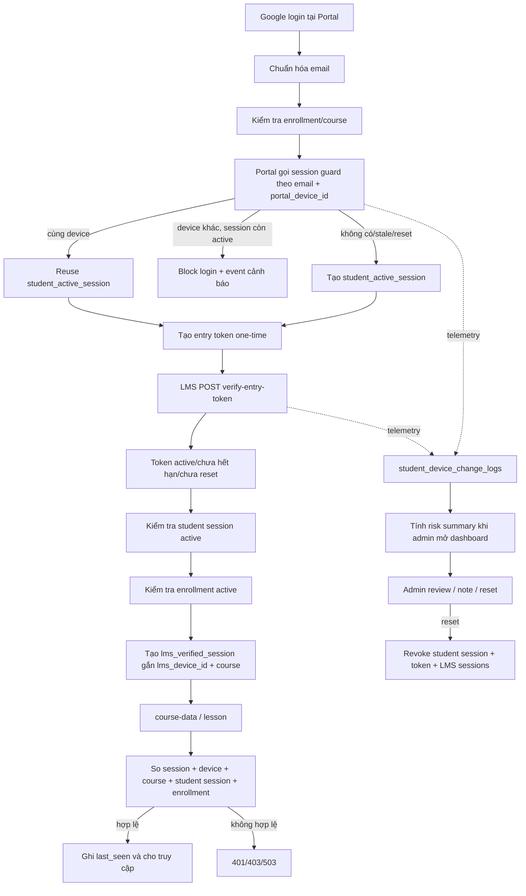

# BÁO CÁO AUDIT READ-ONLY LMS B05

## Cơ chế phát hiện, cảnh báo và xử lý học viên chia sẻ tài khoản

Ngày audit: 2026-07-26  
Múi giờ báo cáo: Asia/Saigon  
Phạm vi: LMS Production B05 và snapshot Production chỉ đọc gần nhất  
Repository: `web-lms-chinh-thuc`  
Exact commit: `fc12c3b21329158e13a4a027833afd2dec61e973`  
Safe tag: `backup/B05-2026-07-25`  
Production deployment tham chiếu: `dpl_HVQvwrveFjxE81cpsoXRraDB34wR`

---

## 1. Kết luận điều hành

Hệ thống hiện có **hai lớp độc lập**:

1. **Lớp enforcement phiên/thiết bị** có thể chặn truy cập thật:
   - tối đa một `student_active_sessions` có trạng thái `active` cho mỗi email;
   - Portal device được nhận diện bằng `portal_device_id`;
   - LMS browser profile được nhận diện bằng `lms_device_id`;
   - một LMS verified session phải khớp chính xác session ID, device ID, course, student session và enrollment;
   - session không hoạt động, hết hạn, bị reset, sai device hoặc sai course bị từ chối.

2. **Lớp cảnh báo/risk dashboard**:
   - ghi event vào `student_device_change_logs`;
   - tính điểm theo số browser/device hash, số lần login bị chặn và số lần đổi hash;
   - hiện trong tab cảnh báo chia sẻ tài khoản của LMS admin;
   - admin review, ghi chú, đánh dấu false positive/suspected/resolved hoặc reset session.

Điểm risk **không tự khóa tài khoản, không tự hủy enrollment và không tự revoke session**. Việc chặn thật đến từ session guard, hoặc từ thao tác reset session có chủ đích của admin.

Một giới hạn Production rất quan trọng: snapshot env chỉ đọc có
`LMS_ENTRY_TOKEN_REQUIRED_COURSES`, nhưng **không có**
`V2_GLOBAL_ONE_DEVICE_ENABLED`. Parser mặc định biến thiếu thành `false`.
Do đó exact source hiện chạy ở chế độ tương thích V1: chỉ course nằm trong
allowlist mới bắt buộc LMS verified session; course ngoài allowlist vẫn có
đường xác thực legacy bằng signed cookie/Google credential. Không được diễn
giải “có schema one-device” thành “toàn bộ LMS đang bị ép one-device”.

---

## 2. Phương pháp và mức độ bằng chứng

### 2.1 Đã xác minh từ exact source

Mọi trích dẫn source trong báo cáo này được đọc bằng:

```text
git show fc12c3b21329158e13a4a027833afd2dec61e973:<path>
git grep ... fc12c3b21329158e13a4a027833afd2dec61e973
```

Không dùng `origin/main`. HEAD của worktree và annotated safe tag đều resolve
đúng exact SHA trên. Tracked source diff so với SHA bằng 0.

### 2.2 Đã xác minh read-only từ Production

Snapshot production read-only
`_local_backups/full-system-readonly-20260726-104151` xác nhận:

| Bảng | Row count |
|---|---:|
| `student_active_sessions` | 16 |
| `lms_entry_tokens` | 38 |
| `lms_verified_sessions` | 38 |
| `student_session_controls` | 0 |
| `student_device_change_logs` | 64 |
| `student_account_risk_reviews` | 0 |
| `student_account_risk_summaries` | 1 |
| `student_account_admin_notes` | 0 |
| `admin_audit_logs` | 5 |

Snapshot schema xác nhận các table/index/constraint nêu trong báo cáo tồn tại.
Snapshot danh mục Vercel Production xác nhận tên env
`LMS_ENTRY_TOKEN_REQUIRED_COURSES` tồn tại và
`V2_GLOBAL_ONE_DEVICE_ENABLED` không có. Không đọc hoặc in giá trị secret.

### 2.3 Suy luận

Các tình huống điện thoại/máy tính, VPN, private mode và xóa cookie được suy
luận trực tiếp từ cách client tạo ID và cách server so sánh ID. Chúng không
được thử bằng mutation Production.

### 2.4 Chưa thể khẳng định

- Giá trị cụ thể của allowlist `LMS_ENTRY_TOKEN_REQUIRED_COURSES` không được
  công bố trong artifact env-name-only.
- Source tạo Portal session/entry token nằm ở hệ thống Portal, không nằm trong
  exact repository LMS này. Migration/RPC và phía LMS nhận token đã được xác
  minh; code caller Portal không thể được khẳng định chỉ từ baseline LMS.
- Không gọi Google login, verify-entry-token, logout, admin action hay bất kỳ
  endpoint mutation nào trên Production.

---

## 3. Học viên được nhận diện bằng gì

### 3.1 Email/Google account

Email chuẩn hóa `trim().toLowerCase()` là khóa account logic. Enrollment được
kiểm tra bằng:

```text
student_enrollments.email = normalized session email
student_enrollments.course_slug = session course_slug
status thuộc tập active
```

Tập status active:

```text
active
approved
approved_ready
approved_waiting_content
completed
da duyet
```

Google credential hoặc signed cookie cung cấp identity ở đường legacy.
`course-data.js` đọc `credential`, `sessionToken` hoặc cookie
`course_session_token`. Khi global one-device bật, các nguồn legacy không được
phép tự cấp quyền nội dung.

Nguồn: `utils/lms-handlers/course-data.js:357-405`.

### 3.2 Signed session/cookie

Cookie legacy là `course_session_token`. Frontend còn lưu các key theo course:

```text
course_session_token_<course_slug>
course_session_email_<course_slug>
course_session_exp_<course_slug>
```

Cookie này là lớp tương thích identity, không phải device fingerprint.
`logout.js` xóa cookie sau khi server revoke thành công; khi flag off và không
có verified session hợp lệ, logout chỉ xóa cookie best-effort và trả
`serverRevoked:false`.

Nguồn: `lms.html:448,482-491`;
`utils/lms-handlers/logout.js:26,95-142`.

### 3.3 Portal device ID

`portal_device_id` liên kết một Portal browser profile với
`student_active_sessions`. RPC `handle_student_session_login` dùng chính chuỗi
này để quyết định:

- cùng email + cùng `portal_device_id`: reuse session;
- cùng email + device khác + session cũ chưa stale: block;
- session cũ stale: expire rồi tạo session mới;
- policy `supersede`: thu hồi session cũ rồi tạo mới.

Đây là opaque client identifier, không phải hardware attestation.

### 3.4 LMS device ID

Frontend LMS lưu `lms_device_id` trong `localStorage`.

```javascript
LMS_DEVICE_KEY = "lms_device_id"
```

Nếu thiếu, browser sinh ngẫu nhiên bằng `crypto.getRandomValues`; nếu
`localStorage` lỗi thì sinh ID tạm cho lần chạy. ID được gửi:

- trong body `lms_device_id` khi verify entry token;
- trong header `X-LMS-Device-Id` khi gọi course/lesson/logout.

Nguồn: `lms.html:445,494-520,2378-2419`;
`lesson.html:486-488`.

### 3.5 LMS verified session

Sau khi entry token hợp lệ, server tạo `lms_verified_sessions` với:

```text
lms_session_id
email
student_session_id
lms_device_id
course_slug
entry_token_id
status
ip
user_agent
```

Client lưu session ID tại:

```text
lms_verified_session_id
lms_session_id
```

Mỗi protected request phải gửi cả session ID và device ID. Thiếu một trong hai
trả `missing_lms_session`; sai device trả `device_mismatch`.

### 3.6 Entry token

`lms_entry_tokens` là bridge one-time Portal → LMS:

- raw token chỉ đi qua URL/request;
- database lưu `token_hash` SHA-256;
- status: `active`, `used`, `expired`, `revoked`;
- gắn email, student session, Portal device, course và optional post;
- TTL mặc định 30 phút, override bởi `LMS_ENTRY_TOKEN_TTL_MINUTES`.

Token đã dùng/revoked/expired không dùng lại được.

### 3.7 IP và user agent

IP và user agent được thu thập server-side:

- `student_active_sessions.ip`, `.ip_hash`, `.user_agent`;
- `lms_entry_tokens.created_ip`, `.created_user_agent`;
- `lms_verified_sessions.ip`, `.user_agent`;
- telemetry lưu `ip_hash` và `user_agent`.

IP/user agent **không phải khóa chặn device** trong exact LMS source.
Không có rule impossible travel, geo-distance hay “nhiều IP = tự chặn”.

### 3.8 Browser fingerprint

Không có thư viện fingerprint canvas/audio/WebGL trong exact source.
“Fingerprint” thực tế là client-generated device ID và HMAC hash của ID trong
telemetry. Nó nhận diện browser profile/localStorage, không nhận diện chắc chắn
thiết bị vật lý.

---

## 4. Inventory bảng và khóa liên kết

| Bảng | Vai trò | Khóa/liên kết chính |
|---|---|---|
| `student_active_sessions` | Phiên Portal toàn account | `student_session_id` unique; `email`; `portal_device_id`; partial unique `lower(email)` khi `status='active'` |
| `lms_entry_tokens` | Token dùng một lần Portal→LMS | `token_hash` unique; `student_session_id`; `portal_device_id`; `course_slug` |
| `lms_verified_sessions` | Phiên LMS theo course/device | `lms_session_id` unique; `student_session_id`; `lms_device_id`; `course_slug`; `entry_token_id` FK |
| `student_session_controls` | Mốc revoke theo account | unique `lower(trim(email))`; `session_generation`; `sessions_revoked_before` |
| `student_device_change_logs` | Event/telemetry chống share | `email`; event/device/session hashes; course; risk points; idempotency key |
| `student_account_risk_reviews` | Quyết định review thủ công | unique normalized `email`; status; note; assigned admin; monitoring/resolution |
| `student_account_risk_summaries` | Summary phục vụ dashboard | unique email; score/level/count/reasons/review mirror |
| `student_account_admin_notes` | Ghi chú admin | normalized `email`; `admin_email`; note; time |
| `admin_audit_logs` | Audit thao tác admin | `target_email`; `admin_email`; action; metadata; IP hash; UA |
| `student_enrollments` | Entitlement học | normalized email + course slug + active status |

Không có foreign key cứng nối email giữa mọi bảng. Chuỗi liên kết runtime là:

```text
email
  └─ student_session_id
       ├─ entry token
       └─ LMS verified session
            ├─ lms_device_id
            └─ course_slug → enrollment
```

---

## 5. Luồng đăng nhập và mở khóa học

### 5.1 Sơ đồ tổng thể



### 5.2 Thứ tự phía LMS khi verify entry token

Endpoint:

```text
POST /api/lms/portal?endpoint=verify-entry-token
```

Router: `api/lms/portal.js:34-36`.  
Handler: `utils/lms-handlers/verify-entry-token.js:62-270`.

Thứ tự:

1. bắt buộc `entry_token`;
2. bắt buộc `lms_device_id`;
3. hash và lookup token;
4. token phải `active`;
5. token không được trước mốc `sessions_revoked_before`;
6. token chưa hết `expires_at`;
7. lấy email/course/student session từ token;
8. student session phải tồn tại, đúng email, `active`;
9. student session không stale quá 24 giờ;
10. enrollment email/course phải active;
11. insert `lms_verified_sessions`;
12. đổi token sang `used`;
13. touch student session;
14. ghi event `entry_token_used` và `lms_session_created`;
15. trả course slug và LMS session ID.

### 5.3 Thứ tự mỗi lần đọc course/lesson

`verifyLmsVerifiedSessionAccess()`:

1. đủ `X-LMS-Session-Id` và `X-LMS-Device-Id`;
2. lookup session ID;
3. `session.lms_device_id === header device ID`;
4. LMS session status `active`;
5. đọc song song session-control, student session và enrollment;
6. LMS session không bị reset theo timestamp;
7. LMS session không idle quá TTL;
8. request course khớp session course;
9. student session tồn tại và `active`;
10. student session không bị reset;
11. student session không idle quá TTL;
12. enrollment vẫn active;
13. touch `last_seen_at` cho cả LMS session và student session;
14. cho phép trả nội dung.

Nguồn: `utils/lms-session-guard.js:772-936`.

---

## 6. Giới hạn thiết bị và phiên đồng thời

### 6.1 Giới hạn chính xác

Database có partial unique index:

```sql
UNIQUE (lower(email)) WHERE status = 'active'
```

Vì vậy giới hạn cứng là **một active Portal/student session trên toàn account
email**, không phải một session mỗi course.

Một student session có thể có nhiều LMS verified session cho nhiều course,
nhưng tất cả phải nối về cùng `student_session_id`. Exact schema không có unique
index “một active LMS session mỗi email”; lớp chính là Portal session global.

### 6.2 TTL

| Cấu hình | Default |
|---|---:|
| `LMS_ENTRY_TOKEN_TTL_MINUTES` | 30 phút |
| `STUDENT_SESSION_IDLE_HOURS` | 24 giờ |
| `LMS_SESSION_IDLE_HOURS` | 24 giờ |

Giá trị thiếu/không dương quay về default. Expiry là lazy: được phát hiện khi
login/token/access chạy; exact source không có scheduler quét session định kỳ.

### 6.3 Khi vượt giới hạn

RPC default `p_conflict_policy='block'`. Với một active session khác device và
chưa stale:

```text
ok=false
action=blocked
reason=active_session_on_another_device
```

Session cũ không bị logout. Login mới không tạo session. Policy `supersede`
tồn tại trong RPC nhưng không thấy caller trong exact LMS repository.

---

## 7. Phát hiện đổi thiết bị

Hệ thống không so sánh IP để quyết định “đổi thiết bị”. Hai điểm so sánh là:

1. Portal login: exact equality của `portal_device_id`;
2. LMS access: exact equality của `lms_device_id` với device đã bind vào
   `lms_verified_sessions`.

Telemetry có thể lưu:

- `old_device_hash`, `new_device_hash`;
- `old_device_label`, `new_device_label`;
- `lms_device_hash`;
- `lms_session_hash`;
- `ip_hash`;
- `user_agent`.

Các hash dùng HMAC-SHA256 với `ACCOUNT_EVENT_HASH_SECRET`. Thiếu secret làm hash
null và metadata `hash_secret_missing=true`; telemetry vẫn best-effort và không
được phép làm chặn truy cập.

---

## 8. Event nào được ghi và event nào tạo rủi ro

Các event type exact:

```text
portal_session_created
portal_session_reused
login_blocked_other_device
entry_token_created
entry_token_used
entry_token_rejected
lms_session_created
lms_session_rejected
logout
admin_reset
admin_note
admin_mark_reviewed
admin_mark_suspected
```

Điểm event mặc định trong helper:

| Event | Điểm khai báo |
|---|---:|
| `login_blocked_other_device` | 25 |
| `entry_token_rejected` | 10 |
| `lms_session_rejected` | 10 |
| `logout` | 4 |
| Event còn lại | 0 |

Tuy nhiên dashboard P1 **không cộng trực tiếp toàn bộ `risk_points` từng row**.
Nó tính lại theo tập device/block/change trong window. Vì vậy bảng điểm event
và công thức dashboard là hai khái niệm khác nhau.

Không có source rule cho:

- geo/impossible travel;
- khoảng cách IP;
- “đăng nhập quá nhanh giữa hai quốc gia”;
- chỉ đổi user-agent là cảnh báo;
- nhiều user cùng NAT;
- VPN detection.

Token reuse bị từ chối do status không còn active và có thể ghi
`entry_token_rejected` nếu row token/email còn tìm được.

---

## 9. Công thức risk score

Handler:
`utils/lms-handlers/admin-account-sharing-alerts.js:summarizeEmailEvents()`.

Chỉ event không phải admin và có hash version hiện tại
`hmac_sha256_v2` được tính. Event trùng `event_idempotency_key` bị dedupe.

```text
device24Score =
  min(max(0, uniqueDevices24h - 1) × 18, 36)

device7Score =
  min(max(0, uniqueDevices7d - 2) × 10, 30)

blockedScore =
  min(blockedCount × 14, 42)

changeScore =
  min(max(0, deviceChangeCount - 1) × 8, 24)

riskScore =
  device24Score + device7Score + blockedScore + changeScore
```

`deviceChangeCount` tăng khi event có cả old/new device hash và hai hash khác
nhau.

Ngưỡng:

| Score | Level |
|---:|---|
| `< 20` | `normal` |
| `20–44` | `watch` |
| `45–79` | `suspicious` |
| `>= 80` | `high` |

Ví dụ giả:

```text
student@example.test
3 device hash trong 24h → 36
2 lần login bị chặn   → 28
3 lần device change  → 16
Tổng                 → 80 → high
```

Summary được refresh/upsert khi admin gọi GET danh sách cảnh báo. Không có
scheduler được tìm thấy trong exact source. `stale_after` được đặt 15 phút
nhưng list handler vẫn recompute trước query; nó không phải worker schedule.

---

## 10. Cảnh báo xuất hiện ở đâu

### 10.1 LMS admin

Trang:

```text
/lms-admin.html
```

Tab:

```text
id="tabBtn-account-sharing"
id="tabContent-account-sharing"
```

API:

```text
GET  /api/lms/admin?endpoint=account-sharing-alerts
GET  /api/lms/admin?endpoint=account-sharing-alerts&mode=detail&email=...
POST /api/lms/admin?endpoint=account-sharing-alerts
```

Router: `api/lms/admin.js:102-106`.  
Handler: `utils/lms-handlers/admin-account-sharing-alerts.js`.

### 10.2 Admin nhìn thấy

Danh sách/chi tiết có thể hiển thị:

- email;
- risk score/level/label;
- số profile 24h/7d/30d;
- blocked count;
- device-change count;
- thời điểm event gần nhất;
- nhãn device gần đây nếu có;
- course slug;
- reason;
- timeline event;
- Portal/student session status và timestamps;
- LMS session course/status/timestamps;
- review status/note/assigned admin;
- admin notes và audit actions.

Detail query chủ động không select IP thô, device hash của session hay LMS
session ID. Timeline event có các hash và user agent theo schema; UI cần được
coi là dữ liệu nhạy cảm dù hash không phải raw ID.

`student-trace` là màn hình khác, thiên về order/enrollment/Drive; exact handler
không đọc risk tables. Không nên nhầm student trace với account-sharing detail.

### 10.3 Không có cảnh báo tự động ra ngoài

Không tìm thấy trong exact source:

- email cảnh báo cho admin/học viên;
- SMS/push notification;
- cảnh báo trên commerce storefront;
- cảnh báo Portal dashboard tự động;
- webhook risk alert.

Cảnh báo hiện là database + LMS admin dashboard.

---

## 11. Khi nào chỉ cảnh báo và khi nào chặn thật

| Tình huống | Log/risk | Chặn thật |
|---|---|---|
| Cùng Portal device, session còn active | event reuse có thể ghi, 0 điểm | Không |
| Portal device khác, session cũ còn active | blocked event/risk | Có, ở Portal guard |
| Sai LMS device ID | có thể có rejected telemetry tùy caller | Có, protected API trả 401 |
| Entry token đã dùng/hết hạn/reset | rejected event nếu nhận diện được row | Có |
| Session idle > TTL | lifecycle update | Có |
| Enrollment không active | không phải risk sharing | Có |
| Nhiều IP nhưng cùng device ID | có thể lưu IP/hash | Không có rule tự chặn |
| User-agent đổi | lưu telemetry | Không có rule tự chặn |
| Risk score `high` | hiện dashboard | Không tự chặn |
| Admin mark suspected | review/audit | Không tự chặn |
| Admin reset session | audit/review | Có, revoke toàn session chain |

---

## 12. Admin review, reset và revoke

### 12.1 Review actions

POST body `action` có thể là:

```text
add_note
reset_session
mark_monitoring
mark_reviewed
mark_suspected
mark_false_positive
mark_resolved
cleanup_retention
```

Review status:

```text
new
monitoring
reviewed
suspected_sharing
false_positive
resolved
```

Đánh dấu review chỉ update/insert `student_account_risk_reviews`, mirror fields
sang `student_account_risk_summaries`, và ghi `admin_audit_logs`. Nó không đổi
enrollment/session trừ action `reset_session`.

### 12.2 Add note

`add_note`:

- insert `student_account_admin_notes`;
- update review note/assigned admin;
- ghi audit `account_sharing_add_note`.

### 12.3 Reset device/session

Endpoint:

```text
POST /api/lms/admin?endpoint=account-sharing-alerts
{
  "action": "reset_session",
  "email": "student@example.test",
  "reason": "Học viên đổi máy hợp lệ"
}
```

Reason bắt buộc, trim, tối đa 500 ký tự.

Handler gọi `resetStudentSessionByEmail()`, ưu tiên RPC
`reset_student_session_guard`.

RPC thực hiện atomic theo email:

1. advisory lock;
2. upsert `student_session_controls`;
3. tăng `session_generation`;
4. đặt `sessions_revoked_before=now`;
5. đổi active `student_active_sessions` → `admin_reset`;
6. active `lms_entry_tokens` → `revoked`;
7. active `lms_verified_sessions` → `admin_reset`;
8. ghi `admin_audit_logs`;
9. API chuyển review status sang `monitoring`.

Nó không xóa enrollment, course, lesson, order hoặc account Google.

### 12.4 Logout all/revoke

`reset_session` là cơ chế gần nhất với “logout all/reset device”.
Student logout:

```text
POST /api/lms/portal?endpoint=logout
```

chỉ mark current `student_active_sessions` là `logged_out`. Exact JS helper
không cascade token/LMS session trong cùng function, nhưng lần access sau bị
chặn vì parent student session không còn active. Admin RPC mới là đường revoke
chain đầy đủ.

Không có endpoint riêng tên `allow_device_change`. Quy trình an toàn là xác
minh học viên, reset session có reason, rồi để học viên đăng nhập lại để tạo
device/session chain mới.

---

## 13. Phạm vi áp dụng

- Primary one-device index: toàn account/email, xuyên course.
- LMS verified session: theo email + student session + LMS device + course.
- Enrollment: theo email + course.
- Risk summary/review: theo email toàn account, nhưng giữ danh sách course
  liên quan.
- Course ngoài protected scope khi global flag off có thể dùng legacy auth.

Do đó câu đúng là: “guard thiết kế global theo account, nhưng enforcement nội
dung Production hiện phụ thuộc feature flag/allowlist”.

---

## 14. Feature flags và runtime Production

| Key | Nguồn | Default exact source | Snapshot Production |
|---|---|---|---|
| `V2_GLOBAL_ONE_DEVICE_ENABLED` | Vercel env + runtime master gate | `false` | Không có trong env-name snapshot → false |
| `LMS_ENTRY_TOKEN_REQUIRED_COURSES` | Vercel env | empty list | Có key; giá trị không công bố |
| `LMS_ENTRY_TOKEN_TTL_MINUTES` | env | 30 | Không thấy trong snapshot name list được audit |
| `STUDENT_SESSION_IDLE_HOURS` | env | 24 | Không thấy trong snapshot name list được audit |
| `LMS_SESSION_IDLE_HOURS` | env | 24 | Không thấy trong snapshot name list được audit |
| `V2_RISK_SCORING_ENABLED` | flag catalog | false | Không có trong env-name snapshot |
| `ACCOUNT_EVENT_HASH_SECRET` | secret env | không có fallback hash an toàn | Có tên; giá trị không đọc |

`V2_GLOBAL_ONE_DEVICE_ENABLED` còn bị restrict-only gate bởi runtime controller.
Nếu active mode là V1 hoặc kill switch bật, function trả false dù env flag true.

`V2_RISK_SCORING_ENABLED` được khai báo trong catalog nhưng exact
`admin-account-sharing-alerts.js` không kiểm tra flag này trước khi tính score.
Vì vậy đây là scaffolding/diagnostic flag, không phải gate thực tế của dashboard
risk hiện tại.

---

## 15. Phần có schema/UI nhưng runtime chưa nối đầy đủ

1. `V2_RISK_SCORING_ENABLED` không điều khiển handler risk đang chạy.
2. Risk summary không có background worker; refresh xảy ra khi admin GET list.
3. `stale_after` có schema nhưng không thấy scheduler dùng nó.
4. Cleanup 180 ngày tồn tại dưới dạng RPC/admin action, không thấy cron tự chạy.
5. Điểm risk không nối vào auth decision.
6. `mark_suspected` không tự revoke.
7. `p_conflict_policy='supersede'` có trong SQL, nhưng không thấy LMS caller.
8. Portal login caller không nằm trong repo LMS; chỉ contract SQL/LMS receiver
   được xác minh ở baseline này.
9. Global enforcement đã implement trong source nhưng env Production snapshot
   không bật.
10. `createStudentActiveSession()` JS tồn tại nhưng không thấy caller trong
    exact LMS repo; session creation thuộc Portal/RPC boundary.

---

## 16. Phản ứng với các tình huống đời thực

### 16.1 Điện thoại và máy tính cá nhân

Nếu Portal tạo device ID khác nhau, thiết bị thứ hai bị block trong khi session
thứ nhất còn active. Đây có thể là hành vi hợp lệ nhưng vẫn xung đột với policy
một device/account.

Nếu course ngoài protected scope do flag off/allowlist, đường legacy có thể
không chịu toàn bộ verified-session enforcement.

### 16.2 Đổi trình duyệt

Chrome và Safari có localStorage riêng → LMS/Portal device ID khác → được xem
như profile mới. User-agent không phải yếu tố quyết định.

### 16.3 Xóa cookie

Xóa cookie signed session làm mất legacy session, nhưng nếu localStorage device
ID còn thì device identity có thể giữ. Nếu xóa cả site data/localStorage, ID mới
được sinh và có thể bị coi là device khác.

### 16.4 Đổi Wi-Fi/4G

IP đổi nhưng device ID không đổi: exact guard không block chỉ vì IP. Telemetry
có thể có IP/hash mới nhưng công thức dashboard không chấm điểm theo IP.

### 16.5 VPN

Giống đổi mạng: không có VPN detector/geo rule. Không tự chặn nếu device/session
chain vẫn khớp.

### 16.6 Private mode/Safari

Private profile có storage tách biệt hoặc không bền. Mỗi phiên có thể sinh ID
mới, gây block hoặc tăng unique device hash/risk — false positive đáng kể.

### 16.7 Đăng nhập lại sau thời gian dài

Sau default 24 giờ idle, session cũ được lazy-expire; login/access mới có thể
tạo chain mới. Không cần admin reset nếu stale branch chạy đúng.

---

## 17. False positive có thể xảy ra

- học viên dùng hợp lệ cả điện thoại và máy tính;
- Chrome/Safari là hai localStorage profile;
- xóa site data/cookie/localStorage;
- Safari private mode;
- browser profile mới hoặc máy reset;
- localStorage bị browser/privacy tool chặn;
- fallback random ID khi storage exception;
- hash secret/version thay đổi làm event cũ bị loại hoặc profile nhìn khác;
- nhiều lần thử lại token hết hạn làm tăng rejected telemetry;
- mobile IP đổi không trực tiếp tăng score, nhưng dễ bị admin diễn giải sai khi
  xem log;
- user-agent tự update không tăng score trực tiếp, nhưng nhãn hiển thị có thể
  khiến admin tưởng là máy khác;
- nhiều người chung NAT không phải sharing proof;
- VPN không phải sharing proof.

Risk score chỉ là tín hiệu điều tra, không phải bằng chứng kết luận.

---

## 18. Lỗ hổng và giới hạn hiện tại

### 18.1 Device ID có thể bị sao chép/giả

ID nằm trong localStorage và header/body do client gửi. Người có kỹ thuật có
thể sao chép cả session ID lẫn device ID. Không có hardware-backed key,
WebAuthn binding hay attestation.

### 18.2 IP không đáng tin

Proxy/VPN/mobile NAT làm IP đổi; nhiều người có thể dùng chung IP. Exact risk
formula không dùng IP, điều này giảm false positive nhưng cũng bỏ lỡ một tín
hiệu bổ sung.

### 18.3 Global enforcement chưa bật

Đây là gap lớn nhất. Course ngoài allowlist vẫn có legacy cookie/credential
path khi global flag false.

### 18.4 Portal boundary chưa được chứng minh từ repo này

One-device login block xảy ra tại Portal RPC caller. Exact baseline LMS không
chứa caller đó, nên audit LMS không thể chứng minh deployment Portal đang gọi
RPC với policy nào.

### 18.5 Risk tính on-demand

Không scheduler; admin không mở dashboard thì summary có thể không được refresh.
Không có realtime notification.

### 18.6 Không auto-enforcement theo risk

High score vẫn truy cập nếu session/enrollment hợp lệ. Đây là chủ ý an toàn
chống false positive, nhưng cần quy trình admin.

### 18.7 Cleanup không tự động

RPC cleanup tồn tại, default 180 ngày, minimum 30; không thấy cron. Event cũ có
thể tích tụ nếu admin không chạy cleanup.

### 18.8 Race và locking

Portal RPC có `pg_advisory_xact_lock(hashtext(email))` và unique partial index,
giảm race session creation. Admin reset dùng advisory lock với namespace khác.
Không có bằng chứng distributed lock ở client. Access touch và reset có thể
giao nhau; timestamp control làm request tạo trước reset bị revoke ở lần check.

### 18.9 Logout không cascade ngay mọi child row

Student logout mark parent logged_out; child LMS rows có thể còn status active
trong DB nhưng bị fail khi verify parent. Admin reset mới đổi toàn bộ child
status trong transaction.

### 18.10 Telemetry best-effort

Insert event lỗi không được phép block. Vì vậy có thể có block thật nhưng thiếu
event/risk timeline.

---

## 19. Khác biệt giữa tài liệu và exact source

Tài liệu deep-dive mô tả đầy đủ inventory session/risk nhưng không nên được đọc
như bằng chứng global enforcement đang bật. Exact source và snapshot env cho
thấy:

- global one-device behavior có code nhưng flag Production vắng;
- allowlist legacy vẫn là fallback thực tế;
- risk scoring diễn ra trong admin handler, không bị gate bởi
  `V2_RISK_SCORING_ENABLED`;
- risk không tự khóa;
- summary refresh là request-driven, không phải scheduler;
- Portal caller không có trong repo LMS.

Khi có khác biệt diễn giải, báo cáo này ưu tiên exact SHA và snapshot env/schema
read-only.

---

## 20. Cơ chế hiện tại dễ hiểu cho chủ hệ thống

Hệ thống gắn mỗi học viên với email, một phiên Portal và một mã browser. Khi đi
từ Portal vào khóa học được bảo vệ, học viên nhận một link/token dùng một lần.
LMS đổi token đó thành một phiên học gắn với đúng browser và đúng khóa học.

Nếu browser gửi sai mã, session hết hạn/bị reset, khóa học không khớp hoặc
enrollment không còn hiệu lực, LMS chặn nội dung. Song song, hệ thống lưu các
sự kiện để admin xem dấu hiệu dùng nhiều browser.

Dashboard tính điểm để ưu tiên điều tra. Điểm cao không đồng nghĩa chắc chắn
chia sẻ và không tự khóa học viên.

Hiện chính sách này chưa được ép trên toàn bộ LMS vì global flag không có trong
snapshot Production. Mức bảo vệ thực tế phụ thuộc course allowlist.

---

## 21. Khi nào hệ thống chỉ cảnh báo và khi nào thật sự chặn

**Chỉ cảnh báo/log:**

- nhiều device hash trong cửa sổ thời gian;
- nhiều lần đổi profile;
- token/session rejection được ghi telemetry;
- IP/user-agent thay đổi;
- risk score watch/suspicious/high;
- admin đánh dấu suspected/monitoring.

**Chặn thật:**

- Portal phát hiện active session trên `portal_device_id` khác;
- protected endpoint thiếu/sai verified session;
- `lms_device_id` không khớp;
- session/token hết hạn, used, revoked hoặc admin-reset;
- course mismatch;
- enrollment không active;
- lỗi policy khi global flag bật có thể fail-closed 503.

**Admin chủ động chặn phiên:**

- action `reset_session`.

Không có auto-lock account/enrollment dựa trên risk score.

---

## 22. Cách admin kiểm tra một học viên nghi chia sẻ tài khoản

1. Mở LMS admin → tab cảnh báo chia sẻ tài khoản.
2. Tìm email chuẩn hóa của học viên.
3. Đọc risk reasons, không chỉ nhìn tổng score.
4. Mở detail timeline.
5. So sánh:
   - số profile 24h/7d;
   - lần login bị block;
   - course liên quan;
   - session status/last seen;
   - device label;
   - review/note cũ.
6. Đối chiếu với thông tin học viên cung cấp: đổi máy, đổi browser, private
   mode, xóa dữ liệu web hay không.
7. Nếu hợp lệ, ghi note và mark false positive/monitoring.
8. Chỉ reset session khi cần cho thiết bị mới đăng nhập sạch.
9. Không xóa enrollment/order/course để xử lý vấn đề session.

`student-trace` có thể dùng bổ sung để kiểm tra order/enrollment/Drive, nhưng
không thay thế account-sharing detail.

---

## 23. Cách xử lý an toàn khi học viên đổi máy hợp lệ

1. Xác minh đúng email và enrollment.
2. Hỏi học viên đã logout máy cũ chưa.
3. Nếu máy cũ còn active và học viên không thể logout, tại tab cảnh báo chọn
   reset session.
4. Nhập reason rõ ràng, không chứa thông tin nhạy cảm không cần thiết, ví dụ:
   `Học viên đổi điện thoại hợp lệ ngày 2026-07-26`.
5. Hệ thống revoke session/token hiện tại và chuyển review sang monitoring.
6. Yêu cầu học viên đăng nhập lại từ Portal trên máy mới.
7. Kiểm tra session mới active và course đúng.
8. Mark false positive hoặc resolved sau khi xác nhận.

Không sửa enrollment, không cấp lại order, không đổi course slug và không can
thiệp trực tiếp row session bằng Supabase UI.

---

## 24. Các giới hạn và rủi ro hiện tại

- client device ID không chống giả mạo;
- global one-device chưa bật theo snapshot env;
- Portal login caller chưa nằm trong audit source;
- score có false positive với multi-device/private mode;
- không realtime alert/email;
- không auto-refresh bằng scheduler;
- không auto-cleanup;
- không auto-enforce theo score;
- logout parent không cập nhật ngay status mọi child row;
- telemetry có thể fail best-effort;
- admin có thể diễn giải nhầm IP/user-agent;
- allowlist value chưa được công bố trong audit;
- high score không phải chứng cứ account sharing.

---

## 25. Những cải tiến nên làm nhưng chưa được phép triển khai trong task này

1. Audit riêng exact Portal Production source và deployment để xác minh Google
   login → enrollment → RPC → entry-token end-to-end.
2. Lập danh sách course thực tế trong `LMS_ENTRY_TOKEN_REQUIRED_COURSES` ở báo
   cáo restricted-access.
3. Thiết kế rollout có test trước khi bật global one-device.
4. Thêm scheduled summary refresh/retention cleanup có monitoring.
5. Thêm notification read-only cho admin khi risk vượt ngưỡng.
6. Tách browser-profile change khỏi physical-device change trong ngôn ngữ UI.
7. Thêm policy hợp lệ cho hai thiết bị cá nhân nếu owner muốn giảm false
   positive.
8. Dùng server-issued rotating device credential hoặc WebAuthn thay opaque
   localStorage ID.
9. Bổ sung IP/UA anomaly dưới dạng tín hiệu mềm, không auto-block.
10. Thêm atomic cascade cho student logout nếu được duyệt.
11. Bổ sung integration test race giữa reset/login/access.
12. Gắn risk summary refresh với explicit feature flag hoặc bỏ flag scaffolding
    gây hiểu nhầm.

Không cải tiến nào trong danh sách này được triển khai trong task audit.

---

## 26. File/function/endpoint tham chiếu

| Chủ đề | Source |
|---|---|
| Constants, risk levels, hashing | `utils/lms-session-guard.js:29-178` |
| Event writer | `utils/lms-session-guard.js:181-305` |
| Session controls | `utils/lms-session-guard.js:356-375` |
| Active student sessions | `utils/lms-session-guard.js:417-562` |
| Entry tokens | `utils/lms-session-guard.js:564-668` |
| LMS verified sessions | `utils/lms-session-guard.js:670-769` |
| Access decision | `utils/lms-session-guard.js:772-936` |
| Scope/allowlist | `utils/lms-session-guard.js:939-973` |
| Flag parser | `utils/v2-flags.js:80-120` |
| Verify entry endpoint | `utils/lms-handlers/verify-entry-token.js:62-270` |
| Course access | `utils/lms-handlers/course-data.js:340+` |
| Lesson access | `utils/lms-handlers/lesson.js:359+` |
| Student logout | `utils/lms-handlers/logout.js:51-143` |
| Portal router | `api/lms/portal.js:13-41` |
| Admin router | `api/lms/admin.js:41-112` |
| Risk formula/list/detail/actions | `utils/lms-handlers/admin-account-sharing-alerts.js` |
| Student trace boundary | `utils/lms-handlers/admin-student-trace.js` |
| LMS client device/session | `lms.html:440-520,2378-2423` |
| Lesson client device/session | `lesson.html:472+` |
| Base session schema | `migration_student_session_guard.sql` |
| One-active/RPC/device log | `migration_atomic_session_guard.sql` |
| Review/note/audit schema | `migration_account_sharing_alerts.sql` |
| Reset/session control | `migration_account_sharing_p0_hardening.sql` |
| Summary/retention | `migration_account_sharing_p1.sql` |

---

## 27. Audit boundary

Task này chỉ đọc source, Git metadata, tài liệu và snapshot Production đã được
backup read-only. Không sửa code, không deploy, không ghi Supabase, không gọi
endpoint mutation, không đăng nhập bằng tài khoản học viên/admin thật và không
hiển thị secret, raw token, full session ID, IP hoặc email Production.

