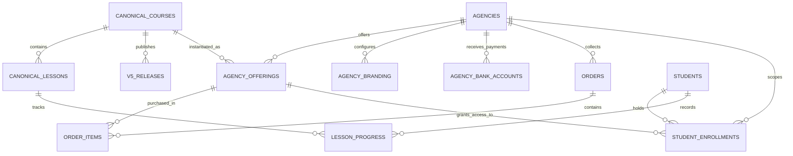
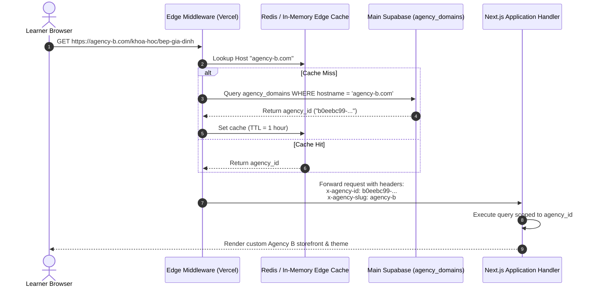

# SYSTEM B — MULTI-AGENCY MASTER IMPLEMENTATION PLAN
**Target Architecture, Tenant Isolation Model & Execution Roadmap for Agency A, B, and C**

**Document Version**: `1.0.0-AUTHORITATIVE`  
**Date**: `2026-09-26`  
**Classification**: `CONFIDENTIAL / ARCHITECTURAL MASTER PLAN`  
**Status**: `PROPOSED — PENDING OWNER FORMAL APPROVAL`  
**Baseline Recovery Checkpoint**: `SYSTEM_B_CURRENT_PRE_MULTI_AGENCY_20260926T031000Z` (`RESTORE_DRILL_PASS = YES`)  
**Data Context**: `CURRENT_BUSINESS_DATA_CLASSIFICATION = TEST_ONLY` (`OWNER_ALLOWS_FULL_TEST_DATA_RESET = YES`)  

---

## 1. Executive Summary & Core Architectural Principles

System B is transitioning from a cloned, single-tenant web shop and learning platform into a modern, multi-tenant digital academy infrastructure. The platform will power **Agency A** (the baseline Yêu Nấu Ăn / Yêu Bếp flagship), **Agency B** (the first validation agency), and subsequent partner organizations (starting with **Agency C**).

### Architectural North Stars

1. **Shared Canonical Business Core vs. Isolated Tenant Periphery**:
   - High-value digital curriculum, master course structures, and multi-gigabyte HLS video assets on Cloudflare R2 are encoded, secured, and stored **once** in the canonical core.
   - Agencies do not re-encode or duplicate video media. Instead, agencies publish **Agency Offerings** that map to canonical courses, setting their own pricing, storefront presentation, payment channels, and branding.
2. **Zero-Trust Tenant Isolation via PostgreSQL Row-Level Security (RLS)**:
   - All tenant-scoped entities (students, enrollments, orders, bank accounts, viewing progress, site configs) reside in a unified database schema partitioned by `agency_id UUID`.
   - RLS is enforced at the database kernel level with `FORCE ROW LEVEL SECURITY`. Application-layer bugs cannot breach cross-agency boundaries.
3. **Clean Foundation via Test-Data Reset (Owner Waiver)**:
   - Because all current users, students, courses, orders, enrollments, and progress are formally classified as **TEST DATA**, we bypass backwards-compatibility shims, dual-write adapters, and legacy V3/V4 drift columns.
   - The platform starts from a clean, normalized PostgreSQL 17 schema on Main Supabase (`yyiavtiwtekkocqpephr`).
   - Legacy Supabase (`aqozjkfwzmyfunqvcyjv`) is formally retired and decommissioned.
4. **Resolution of T06 Security Defect in Phase 0**:
   - The legacy `sync_outbox` and `sync_deliveries` tables (which had RLS disabled in Legacy DB) are completely eliminated.
   - All tables in the new multi-tenant database have RLS enabled with default-deny policies before any real business data is onboarded.
5. **Progressive Rollout Gating**:
   - Agency A baseline migration $\rightarrow$ Agency B end-to-end validation $\rightarrow$ Agency C onboarding strictly after Agency B passes all acceptance criteria.

---

## 2. Target Architecture Overview

```
                      +---------------------------------------+
                      |       Public DNS & Cloudflare         |
                      +---------------------------------------+
                           |              |              |
                agency-a.live      agency-b.com    agency-c.vn
                           \              |              /
                            v             v             v
             +------------------------------------------------------+
             |             Edge Ingress & Tenant Router             |
             |       (Vercel Edge Middleware / Next.js Proxy)       |
             |     - Extracts Hostname -> Resolves agency_id        |
             |     - Injects x-agency-id, x-agency-slug Headers     |
             |     - Applies Tenant-Specific CORS & Headers         |
             +------------------------------------------------------+
                                     |
       +-----------------------------+-----------------------------+
       |                                                           |
       v                                                           v
+-----------------------------+             +-------------------------------+
|     Storefront & Checkout   |             |   LMS Portal & Student Admin  |
|  (yeunauan-commerce-clone)  |             |      (yeunauan-lms-clone)     |
| - Agency Dynamic Branding   |             | - Multi-tenant Student Portal |
| - Agency Offerings & Pricing|             | - Agency Staff Admin Portal   |
| - Agency QR/Bank Checkout   |             | - Platform Superadmin Portal  |
| - Scoped Order Intake       |             | - Lease Issuance (ECDSA P-256)|
+-----------------------------+             +-------------------------------+
       \                                                           /
        \                                                         /
         v                                                       v
      +-------------------------------------------------------------+
      |               Main Supabase Database Cluster                |
      |                 (Project: yyiavtiwtekkocqpephr)             |
      |                                                             |
      |  [Platform / Canonical Core]   [Tenant-Isolated Partitions] |
      |  - agencies                    - agency_offerings (RLS)     |
      |  - canonical_courses           - agency_branding (RLS)      |
      |  - canonical_lessons           - agency_bank_accounts (RLS) |
      |  - v5_media_assets             - orders & items (RLS)       |
      |  - v5_releases                 - students & profiles (RLS)  |
      |  - v5_jobs                     - student_enrollments (RLS)  |
      |  - platform_admins             - lesson_progress (RLS)      |
      |                                - student_devices (RLS)      |
      +-------------------------------------------------------------+
                                     |
                                     | (Authorized Asset Reference)
                                     v
      +-------------------------------------------------------------+
      |                Cloudflare R2 Media Storage                  |
      |               (Bucket: yeubep-system-b-media)               |
      |                                                             |
      |  /v5/releases/{release_id}/*   <- Canonical HLS Video (DRM) |
      |  /agencies/{agency_id}/*       <- Agency Logos, Custom Docs |
      +-------------------------------------------------------------+
                                     ^
                                     | (Stream via Signed Token)
      +-------------------------------------------------------------+
      |            V5 Media Delivery Worker (Cloudflare)            |
      | - Verifies P-256 ECDSA Lease Signature                      |
      | - Validates Student Device Fingerprint & IP                 |
      | - Streams Encrypted HLS Segments directly from R2           |
      +-------------------------------------------------------------+
```

---

## 3. Shared Canonical Business Core vs. Agency Periphery

To balance content reuse with tenant independence, System B establishes a strict boundary between platform-level assets and agency-level commercialization:

| Layer | Component | Multi-Tenancy Scope | Description |
|---|---|---|---|
| **Core** | `canonical_courses` | Global Platform | Master curriculum definition, syllabus, module hierarchy, authoring notes. |
| **Core** | `canonical_lessons` | Global Platform | Lesson units, learning objectives, duration, sequence order, preview eligibility. |
| **Core** | `v5_media_assets` | Global Platform | Raw master video files, transcoded renditions, HLS playlists, audio tracks, subtitles. |
| **Core** | `v5_releases` | Global Platform | Cryptographically sealed, immutable release manifests linking lessons to verified R2 media keys. |
| **Core** | `v5_playback_service` | Global Platform | Centralized lease generation and Cloudflare Worker video delivery infrastructure. |
| **Periphery** | `agencies` | Global Platform | Registry of tenant organizations, domain bindings, lifecycle status (`active`, `suspended`). |
| **Periphery** | `agency_offerings` | Tenant-Scoped (`agency_id`) | Agency-published product: custom display title, marketing slug, public price, sale price, bundle tags. |
| **Periphery** | `agency_branding` | Tenant-Scoped (`agency_id`) | Logo, favicon, primary/secondary theme colors, custom CSS, SEO metadata, contact details. |
| **Periphery** | `agency_bank_accounts` | Tenant-Scoped (`agency_id`) | Agency-owned payment accounts for automated QR code generation (VietQR, direct transfer). |
| **Periphery** | `orders` & `order_items` | Tenant-Scoped (`agency_id`) | Commercial purchase transactions, payment verification receipts, customer billing data. |
| **Periphery** | `students` & `memberships` | Tenant-Scoped (`agency_id`) | Agency-specific student profiles, device fingerprints, verification sessions, active JWTs. |
| **Periphery** | `student_enrollments` | Tenant-Scoped (`agency_id`) | Access grants to specific agency offerings, expiration dates, enrollment audit logs. |
| **Periphery** | `lesson_progress` | Tenant-Scoped (`agency_id`) | Learner milestone tracking, video playback completion percentage, quiz scores. |

---

## 4. Agency Isolation Model & Security Enforcement

### 4.1 Database Isolation via Row-Level Security (RLS)

1. **Mandatory Tenant Foreign Key**:
   Every tenant-scoped table MUST include:
   ```sql
   agency_id UUID NOT NULL REFERENCES public.agencies(id) ON DELETE CASCADE
   ```
2. **Deterministic Context Setting**:
   The current agency context is established in PostgreSQL via session configuration or JWT app metadata:
   - For backend application services (Node.js/Next.js API routes), the client establishes tenant scope using an authenticated RPC before query execution:
     ```sql
     SELECT set_config('app.current_agency_id', 'a0eebc99-9c0b-4ef8-bb6d-6bb9bd380a11', true);
     ```
   - For Supabase client queries using user JWTs:
     ```sql
     CREATE OR REPLACE FUNCTION auth.current_agency_id() RETURNS UUID AS $$
       SELECT NULLIF(current_setting('app.current_agency_id', true), '')::UUID;
     $$ LANGUAGE SQL STABLE;
     ```
3. **Default-Deny Policy Template**:
   Every tenant table enforces strict RLS:
   ```sql
   ALTER TABLE public.orders ENABLE ROW LEVEL SECURITY;
   ALTER TABLE public.orders FORCE ROW LEVEL SECURITY;

   CREATE POLICY tenant_isolation_policy ON public.orders
     FOR ALL
     USING (agency_id = auth.current_agency_id())
     WITH CHECK (agency_id = auth.current_agency_id());
   ```
4. **Superadmin Bypass Guard**:
   System platform admins can access cross-agency data solely when authenticated with the explicit `platform_superadmin` role, tracked in an immutable `admin_audit_logs` table.

### 4.2 Storage Namespacing & Asset Security (Cloudflare R2)

R2 object keys follow a deterministic hierarchical layout:
- **Canonical Media (Shared Read-Only)**:
  `v5/releases/{release_id}/hls/{asset_id}/{rendition}/master.m3u8`  
  `v5/releases/{release_id}/hls/{asset_id}/{rendition}/segment_0001.ts`
- **Agency Assets (Isolated Private)**:
  `agencies/{agency_id}/branding/logo.png`  
  `agencies/{agency_id}/materials/{offering_id}/document.pdf`

Agency admins are granted presigned upload URLs restricted strictly to their own `agencies/{agency_id}/*` prefix.

---

## 5. Identity, Memberships & Role-Based Access Control (RBAC)

### 5.1 Identity Model

The platform decouples **Global User Identity** from **Agency Membership**:
- A single person (identified by phone number or email) possesses one master identity in `auth.users`.
- A user can hold distinct memberships across multiple agencies without cross-tenant data leakage.

```
       [auth.users] (Global Identity: phone, email, auth credentials)
            |
            +------------+------------+
            |                         |
            v                         v
 [agency_memberships]      [agency_memberships]
   agency_id: Agency A       agency_id: Agency B
   role: student             role: agency_staff
   profile: Name A, Dev 1    profile: Name B, Dev 2
            |                         |
            v                         v
 [Agency A Enrollments]    [Agency B Administration]
```

### 5.2 Role Hierarchy

1. `platform_superadmin`: Full control across all agencies, canonical course authoring, global media releases, platform configuration.
2. `agency_owner`: Full control over a single agency: billing setup, bank accounts, staff invitations, offering pricing, student support.
3. `agency_staff`: Read/write access to agency orders, student enrollments, customer support notes, device resets.
4. `student`: Access to enrolled agency offerings, lesson viewing, progress tracking, restricted to authorized devices.

---

## 6. Canonical Course vs. Agency Offering Model



### Offering Customization Capabilities

Agency Offerings allow full commercial flexibility while guaranteeing curriculum consistency:
- **Price Customization**: Agency A may offer "Nấu Ăn Căn Bản" at 499,000 VND; Agency B may bundle or price the same offering at 650,000 VND.
- **Title & Slug Overrides**: Agency B can customize marketing titles (e.g., "Kỹ Thuật Bếp Gia Đình 2026") while referencing the identical canonical course ID.
- **Curriculum Subsets**: An agency can opt to sell only specific modules or standalone masterclasses from the canonical catalog.

---

## 7. Tenant-Aware Data Model (Clean Schema DDL)

Because current business data is classified as **TEST ONLY**, the following schema replaces all legacy tables on Main Supabase:

```sql
-- =============================================================================
-- SYSTEM B MULTI-AGENCY CORE SCHEMA (POSTGRESQL 17 / SUPABASE)
-- =============================================================================

CREATE EXTENSION IF NOT EXISTS "uuid-ossp";
CREATE EXTENSION IF NOT EXISTS "pgcrypto";

-- 1. AGENCIES (TENANT REGISTRY)
CREATE TABLE public.agencies (
    id UUID PRIMARY KEY DEFAULT gen_random_uuid(),
    slug TEXT NOT NULL UNIQUE,
    name TEXT NOT NULL,
    status TEXT NOT NULL DEFAULT 'active' CHECK (status IN ('active', 'suspended', 'archived')),
    primary_domain TEXT NOT NULL UNIQUE,
    created_at TIMESTAMPTZ NOT NULL DEFAULT now(),
    updated_at TIMESTAMPTZ NOT NULL DEFAULT now()
);

-- 2. AGENCY DOMAIN MAPPINGS (FOR MULTI-DOMAIN ROUTING)
CREATE TABLE public.agency_domains (
    id UUID PRIMARY KEY DEFAULT gen_random_uuid(),
    agency_id UUID NOT NULL REFERENCES public.agencies(id) ON DELETE CASCADE,
    hostname TEXT NOT NULL UNIQUE,
    is_primary BOOLEAN NOT NULL DEFAULT false,
    ssl_status TEXT NOT NULL DEFAULT 'pending' CHECK (ssl_status IN ('pending', 'active', 'failed')),
    created_at TIMESTAMPTZ NOT NULL DEFAULT now()
);
CREATE INDEX idx_agency_domains_hostname ON public.agency_domains(hostname);

-- 3. AGENCY BRANDING & STORE CONFIGURATION
CREATE TABLE public.agency_branding (
    agency_id UUID PRIMARY KEY REFERENCES public.agencies(id) ON DELETE CASCADE,
    brand_name TEXT NOT NULL,
    logo_url TEXT,
    favicon_url TEXT,
    primary_color TEXT DEFAULT '#e11d48',
    secondary_color TEXT DEFAULT '#4b5563',
    support_phone TEXT,
    support_email TEXT,
    meta_title TEXT,
    meta_description TEXT,
    custom_css TEXT,
    created_at TIMESTAMPTZ NOT NULL DEFAULT now(),
    updated_at TIMESTAMPTZ NOT NULL DEFAULT now()
);

-- 4. AGENCY BANK ACCOUNTS (SEPARATE REVENUE ROUTING)
CREATE TABLE public.agency_bank_accounts (
    id UUID PRIMARY KEY DEFAULT gen_random_uuid(),
    agency_id UUID NOT NULL REFERENCES public.agencies(id) ON DELETE CASCADE,
    bank_code TEXT NOT NULL,
    account_number TEXT NOT NULL,
    account_holder TEXT NOT NULL,
    branch TEXT,
    is_active BOOLEAN NOT NULL DEFAULT true,
    created_at TIMESTAMPTZ NOT NULL DEFAULT now()
);
CREATE INDEX idx_agency_bank_accounts_agency ON public.agency_bank_accounts(agency_id);

-- 5. CANONICAL COURSES & LESSONS (SHARED PLATFORM CORE)
CREATE TABLE public.canonical_courses (
    id UUID PRIMARY KEY DEFAULT gen_random_uuid(),
    code TEXT NOT NULL UNIQUE,
    default_title TEXT NOT NULL,
    short_description TEXT,
    curriculum_summary JSONB DEFAULT '{}'::jsonb,
    delivery_mode TEXT NOT NULL DEFAULT 'v5' CHECK (delivery_mode IN ('v5', 'hybrid')),
    status TEXT NOT NULL DEFAULT 'draft' CHECK (status IN ('draft', 'published', 'archived')),
    created_at TIMESTAMPTZ NOT NULL DEFAULT now(),
    updated_at TIMESTAMPTZ NOT NULL DEFAULT now()
);

CREATE TABLE public.canonical_lessons (
    id UUID PRIMARY KEY DEFAULT gen_random_uuid(),
    course_id UUID NOT NULL REFERENCES public.canonical_courses(id) ON DELETE CASCADE,
    title TEXT NOT NULL,
    module_name TEXT DEFAULT 'Chương 1',
    sort_order INT NOT NULL DEFAULT 0,
    is_free_preview BOOLEAN NOT NULL DEFAULT false,
    duration_seconds INT DEFAULT 0,
    content_payload JSONB DEFAULT '{}'::jsonb,
    created_at TIMESTAMPTZ NOT NULL DEFAULT now(),
    updated_at TIMESTAMPTZ NOT NULL DEFAULT now(),
    UNIQUE (course_id, sort_order)
);
CREATE INDEX idx_canonical_lessons_course ON public.canonical_lessons(course_id);

-- 6. V5 MEDIA ASSETS & RELEASES (SHARED R2 DELIVERY)
CREATE TABLE public.v5_media_assets (
    id UUID PRIMARY KEY DEFAULT gen_random_uuid(),
    type TEXT NOT NULL CHECK (type IN ('video', 'thumbnail', 'document', 'audio')),
    provider TEXT NOT NULL DEFAULT 'r2',
    r2_object_key TEXT NOT NULL UNIQUE,
    mime_type TEXT NOT NULL,
    original_filename TEXT NOT NULL,
    bytes BIGINT NOT NULL,
    status TEXT NOT NULL DEFAULT 'ready' CHECK (status IN ('processing', 'ready', 'failed')),
    created_at TIMESTAMPTZ NOT NULL DEFAULT now()
);

CREATE TABLE public.v5_releases (
    id UUID PRIMARY KEY DEFAULT gen_random_uuid(),
    course_id UUID NOT NULL REFERENCES public.canonical_courses(id) ON DELETE CASCADE,
    release_tag TEXT NOT NULL,
    snapshot_manifest JSONB NOT NULL,
    is_active BOOLEAN NOT NULL DEFAULT false,
    created_at TIMESTAMPTZ NOT NULL DEFAULT now(),
    UNIQUE (course_id, release_tag)
);
CREATE INDEX idx_v5_releases_course ON public.v5_releases(course_id);

-- 7. AGENCY OFFERINGS (TENANT CATALOG COMMERCIALIZATION)
CREATE TABLE public.agency_offerings (
    id UUID PRIMARY KEY DEFAULT gen_random_uuid(),
    agency_id UUID NOT NULL REFERENCES public.agencies(id) ON DELETE CASCADE,
    canonical_course_id UUID NOT NULL REFERENCES public.canonical_courses(id) ON DELETE RESTRICT,
    slug TEXT NOT NULL,
    display_title TEXT NOT NULL,
    display_description TEXT,
    thumbnail_url TEXT,
    price_vnd BIGINT NOT NULL DEFAULT 0,
    sale_price_vnd BIGINT,
    is_published BOOLEAN NOT NULL DEFAULT false,
    sort_order INT NOT NULL DEFAULT 0,
    created_at TIMESTAMPTZ NOT NULL DEFAULT now(),
    updated_at TIMESTAMPTZ NOT NULL DEFAULT now(),
    UNIQUE (agency_id, slug),
    UNIQUE (agency_id, canonical_course_id)
);
CREATE INDEX idx_agency_offerings_agency ON public.agency_offerings(agency_id);

-- 8. TENANT USERS & MEMBERSHIPS
CREATE TABLE public.agency_memberships (
    id UUID PRIMARY KEY DEFAULT gen_random_uuid(),
    agency_id UUID NOT NULL REFERENCES public.agencies(id) ON DELETE CASCADE,
    user_id UUID NOT NULL, -- references auth.users
    role TEXT NOT NULL DEFAULT 'student' CHECK (role IN ('agency_owner', 'agency_staff', 'student')),
    display_name TEXT NOT NULL,
    phone TEXT,
    status TEXT NOT NULL DEFAULT 'active' CHECK (status IN ('active', 'suspended', 'banned')),
    created_at TIMESTAMPTZ NOT NULL DEFAULT now(),
    updated_at TIMESTAMPTZ NOT NULL DEFAULT now(),
    UNIQUE (agency_id, user_id),
    UNIQUE (agency_id, phone)
);
CREATE INDEX idx_agency_memberships_lookup ON public.agency_memberships(agency_id, user_id);

-- 9. ORDERS & COMMERCIAL TRANSACTIONS
CREATE TABLE public.orders (
    id UUID PRIMARY KEY DEFAULT gen_random_uuid(),
    agency_id UUID NOT NULL REFERENCES public.agencies(id) ON DELETE CASCADE,
    order_code TEXT NOT NULL UNIQUE,
    customer_name TEXT NOT NULL,
    customer_phone TEXT NOT NULL,
    customer_email TEXT,
    total_amount_vnd BIGINT NOT NULL,
    payment_method TEXT NOT NULL DEFAULT 'bank_transfer',
    status TEXT NOT NULL DEFAULT 'pending' CHECK (status IN ('pending', 'completed', 'cancelled', 'refunded')),
    bank_account_id UUID REFERENCES public.agency_bank_accounts(id) ON DELETE SET NULL,
    created_at TIMESTAMPTZ NOT NULL DEFAULT now(),
    updated_at TIMESTAMPTZ NOT NULL DEFAULT now()
);
CREATE INDEX idx_orders_agency ON public.orders(agency_id);

CREATE TABLE public.order_items (
    id UUID PRIMARY KEY DEFAULT gen_random_uuid(),
    agency_id UUID NOT NULL REFERENCES public.agencies(id) ON DELETE CASCADE,
    order_id UUID NOT NULL REFERENCES public.orders(id) ON DELETE CASCADE,
    offering_id UUID NOT NULL REFERENCES public.agency_offerings(id) ON DELETE RESTRICT,
    price_vnd BIGINT NOT NULL,
    quantity INT NOT NULL DEFAULT 1,
    created_at TIMESTAMPTZ NOT NULL DEFAULT now()
);
CREATE INDEX idx_order_items_order ON public.order_items(order_id);

-- 10. STUDENT ENROLLMENTS & LEARNING PROGRESS
CREATE TABLE public.student_enrollments (
    id UUID PRIMARY KEY DEFAULT gen_random_uuid(),
    agency_id UUID NOT NULL REFERENCES public.agencies(id) ON DELETE CASCADE,
    membership_id UUID NOT NULL REFERENCES public.agency_memberships(id) ON DELETE CASCADE,
    offering_id UUID NOT NULL REFERENCES public.agency_offerings(id) ON DELETE RESTRICT,
    status TEXT NOT NULL DEFAULT 'active' CHECK (status IN ('active', 'expired', 'revoked')),
    enrolled_at TIMESTAMPTZ NOT NULL DEFAULT now(),
    expires_at TIMESTAMPTZ,
    UNIQUE (agency_id, membership_id, offering_id)
);
CREATE INDEX idx_student_enrollments_lookup ON public.student_enrollments(agency_id, membership_id);

CREATE TABLE public.lesson_progress (
    id UUID PRIMARY KEY DEFAULT gen_random_uuid(),
    agency_id UUID NOT NULL REFERENCES public.agencies(id) ON DELETE CASCADE,
    membership_id UUID NOT NULL REFERENCES public.agency_memberships(id) ON DELETE CASCADE,
    lesson_id UUID NOT NULL REFERENCES public.canonical_lessons(id) ON DELETE CASCADE,
    progress_percent INT NOT NULL DEFAULT 0 CHECK (progress_percent BETWEEN 0 AND 100),
    is_completed BOOLEAN NOT NULL DEFAULT false,
    last_position_seconds INT NOT NULL DEFAULT 0,
    updated_at TIMESTAMPTZ NOT NULL DEFAULT now(),
    UNIQUE (agency_id, membership_id, lesson_id)
);
CREATE INDEX idx_lesson_progress_lookup ON public.lesson_progress(agency_id, membership_id);

-- 11. STUDENT DEVICE REGISTRATION (ANTI-SHARING ENFORCEMENT)
CREATE TABLE public.student_devices (
    id UUID PRIMARY KEY DEFAULT gen_random_uuid(),
    agency_id UUID NOT NULL REFERENCES public.agencies(id) ON DELETE CASCADE,
    membership_id UUID NOT NULL REFERENCES public.agency_memberships(id) ON DELETE CASCADE,
    device_fingerprint TEXT NOT NULL,
    device_name TEXT,
    last_ip TEXT,
    last_seen_at TIMESTAMPTZ NOT NULL DEFAULT now(),
    is_active BOOLEAN NOT NULL DEFAULT true,
    UNIQUE (agency_id, membership_id, device_fingerprint)
);
CREATE INDEX idx_student_devices_lookup ON public.student_devices(agency_id, membership_id);

-- 12. AUDIT LOGGING
CREATE TABLE public.admin_audit_logs (
    id UUID PRIMARY KEY DEFAULT gen_random_uuid(),
    agency_id UUID REFERENCES public.agencies(id) ON DELETE SET NULL,
    actor_user_id UUID NOT NULL,
    action TEXT NOT NULL,
    entity_type TEXT NOT NULL,
    entity_id TEXT,
    payload JSONB DEFAULT '{}'::jsonb,
    ip_address TEXT,
    created_at TIMESTAMPTZ NOT NULL DEFAULT now()
);
CREATE INDEX idx_admin_audit_logs_agency ON public.admin_audit_logs(agency_id);

-- =============================================================================
-- RLS ENABLEMENT & ZERO-TRUST ENFORCEMENT (FIXES T06 DEFECT)
-- =============================================================================

ALTER TABLE public.agencies ENABLE ROW LEVEL SECURITY;
ALTER TABLE public.agency_domains ENABLE ROW LEVEL SECURITY;
ALTER TABLE public.agency_branding ENABLE ROW LEVEL SECURITY;
ALTER TABLE public.agency_bank_accounts ENABLE ROW LEVEL SECURITY;
ALTER TABLE public.agency_offerings ENABLE ROW LEVEL SECURITY;
ALTER TABLE public.agency_memberships ENABLE ROW LEVEL SECURITY;
ALTER TABLE public.orders ENABLE ROW LEVEL SECURITY;
ALTER TABLE public.order_items ENABLE ROW LEVEL SECURITY;
ALTER TABLE public.student_enrollments ENABLE ROW LEVEL SECURITY;
ALTER TABLE public.lesson_progress ENABLE ROW LEVEL SECURITY;
ALTER TABLE public.student_devices ENABLE ROW LEVEL SECURITY;
ALTER TABLE public.admin_audit_logs ENABLE ROW LEVEL SECURITY;

-- Helper Context Function
CREATE OR REPLACE FUNCTION public.current_agency_id() RETURNS UUID AS $$
    SELECT NULLIF(current_setting('app.current_agency_id', true), '')::UUID;
$$ LANGUAGE SQL STABLE;

-- Tenant Isolation Policies
CREATE POLICY tenant_isolation_agency_branding ON public.agency_branding
    FOR ALL USING (agency_id = public.current_agency_id())
    WITH CHECK (agency_id = public.current_agency_id());

CREATE POLICY tenant_isolation_agency_bank_accounts ON public.agency_bank_accounts
    FOR ALL USING (agency_id = public.current_agency_id())
    WITH CHECK (agency_id = public.current_agency_id());

CREATE POLICY tenant_isolation_agency_offerings ON public.agency_offerings
    FOR ALL USING (agency_id = public.current_agency_id())
    WITH CHECK (agency_id = public.current_agency_id());

CREATE POLICY tenant_isolation_agency_memberships ON public.agency_memberships
    FOR ALL USING (agency_id = public.current_agency_id())
    WITH CHECK (agency_id = public.current_agency_id());

CREATE POLICY tenant_isolation_orders ON public.orders
    FOR ALL USING (agency_id = public.current_agency_id())
    WITH CHECK (agency_id = public.current_agency_id());

CREATE POLICY tenant_isolation_order_items ON public.order_items
    FOR ALL USING (agency_id = public.current_agency_id())
    WITH CHECK (agency_id = public.current_agency_id());

CREATE POLICY tenant_isolation_student_enrollments ON public.student_enrollments
    FOR ALL USING (agency_id = public.current_agency_id())
    WITH CHECK (agency_id = public.current_agency_id());

CREATE POLICY tenant_isolation_lesson_progress ON public.lesson_progress
    FOR ALL USING (agency_id = public.current_agency_id())
    WITH CHECK (agency_id = public.current_agency_id());

CREATE POLICY tenant_isolation_student_devices ON public.student_devices
    FOR ALL USING (agency_id = public.current_agency_id())
    WITH CHECK (agency_id = public.current_agency_id());
```

---

## 8. Agency-Specific Storefront, Admin & Learner Experience

### 8.1 Ingress & Domain Routing Architecture

The Edge Ingress Layer (Next.js Edge Middleware) executes the tenant resolution handshake on every inbound HTTP request:



### 8.2 Storefront & Checkout (yeunauan-commerce-clone)
- **Theme Injection**: Storefront reads `agency_branding` and dynamically sets CSS custom properties (`--primary-color`, logo, favicon, typography).
- **Catalog Presentation**: Only queries `agency_offerings` where `agency_id = req.headers['x-agency-id']` AND `is_published = true`.
- **Payment Routing**: Checkout fetches active `agency_bank_accounts` for `agency_id`, generating a custom VietQR payload formatted specifically for that agency’s bank.

### 8.3 Student Learning Portal (yeunauan-lms-clone)
- **Scoped Portal Dashboard**: When a learner logs into `agency-b.com/portal`, they only see courses enrolled under `agency_id = Agency B`.
- **Cross-Domain Separation**: Even if the learner also possesses an account on `agency-a.live`, sessions and tokens remain partitioned by the host domain cookie origin.

---

## 9. Shared V5 Content & Media Delivery Lifecycle

The V5 Media Pipeline guarantees cryptographic anti-leeching, anti-downloading, and device-bound playback without duplicating video storage:

```
[Authoring / Upload]
Master MP4 Video -> Uploaded to R2 -> Transcoded into multi-bitrate HLS
                    -> Master m3u8 & ts segments created under /v5/releases/{rel_id}/
                    -> Cryptographically signed manifest saved to v5_releases.
                                      |
[Commercialization]                   v
Agency A Offering  ----------------> [Canonical Course #1] <---------------- Agency B Offering
(Price: 499k VND)                                                          (Price: 650k VND)
                                      |
[Playback Lease Request]              v
Learner (Agency B) clicks "Play" -> LMS API /api/v5-play:
  1. Verifies student enrollment in Agency B offering for this canonical course.
  2. Verifies student device registration (max 2 active devices).
  3. Issues Ephemeral Lease signed with Platform P-256 ECDSA Private Key:
     {
       "sub": "student_membership_id",
       "agency_id": "agency_b_uuid",
       "course_id": "canonical_course_uuid",
       "asset_id": "media_asset_uuid",
       "exp": 1727350000,
       "device_sig": "hash_of_client_public_jwk"
     }
                                      |
[Media Delivery]                      v
Learner Video Player -> Cloudflare Worker (V5_MEDIA_PUBLIC_URL):
  1. Validates P-256 ECDSA Lease signature via public key.
  2. Confirms expiry window (10 minutes).
  3. Pulls raw encrypted segments from R2: /v5/releases/{rel_id}/hls/...
  4. Delivers streaming video chunks directly to player memory buffer.
```

---

## 10. Deployment Topology & Infrastructure

### 10.1 Dual-Repository Strategy (Coordinated Evolution)

To minimize deployment friction during initial rollout, the system preserves the two core repositories while refactoring them to share the unified database:

1. **`yeunauan-commerce-clone` (Storefront & Commercial Ingress)**:
   - Deployed on Vercel.
   - Handles custom domains for Agency A (`shop.yeunauan.live` / `daubepnho.store`), Agency B (`shop.agency-b.com`), Agency C.
   - Connects to Main Supabase using `SUPABASE_ANON_KEY` and tenant-aware RPCs.
2. **`yeunauan-lms-clone` (Learning Portal, V5 Video Engine & Admin)**:
   - Deployed on Vercel.
   - Handles LMS domains (`lms.yeunauan.live`, `learn.agency-b.com`).
   - Issues V5 playback leases; connects to Main Supabase via secure server-side client.
3. **Cloudflare Worker (`v5-media-delivery`)**:
   - Deployed on Cloudflare Edge.
   - Direct binding to Cloudflare R2 bucket `yeubep-system-b-media`.
   - Shared across all agencies for high-throughput video delivery.

---

## 11. Security Hardening & T06 Elimination Plan

### 11.1 Elimination of Legacy T06 Defect

| Security Area | Legacy State (Defect T06) | Multi-Agency Target State (Hardened) |
|---|---|---|
| `sync_outbox` | `rowsecurity = false`, anon/auth DML allowed | **Table Obsoleted & Dropped.** Direct cross-repo sync replaced by unified database tables. |
| `sync_deliveries` | `rowsecurity = false`, anon/auth DML allowed | **Table Obsoleted & Dropped.** Legacy polling queue replaced by PostgreSQL events/triggers. |
| Public Schema Tables | 25/27 RLS ON (2 tables unprotected) | **100% of tables (12/12) have RLS ON with `FORCE ROW LEVEL SECURITY`.** |
| Database Target | Split across Main and Legacy Supabase | **Single authoritative PostgreSQL 17 cluster (Main Supabase).** |
| Access Control | Role grants to anon role on sync tables | **Anon role restricted to public storefront reads; all writes require JWT or API signature.** |

### 11.2 Comprehensive Security Controls

1. **Strict CORS Policy**: Next.js Edge Middleware checks `Origin` against `agency_domains` table. Unrecognized cross-origin requests are rejected.
2. **Ephemeral Playback Leases**: Lease duration is restricted to 10 minutes, bound to client-side Web Crypto device proof keys.
3. **Admin Audit Logging**: Every staff login, enrollment modification, device reset, or bank detail change writes an immutable row to `admin_audit_logs`.

---

## 12. Migration & Rollout Phases

```
+-----------------------------------------------------------------------------------+
| Milestone 0: Clean Schema Foundation & T06 Elimination                            |
| - Reset test data on Main Supabase.                                               |
| - Deploy Multi-Agency Schema DDL & 100% RLS policies.                             |
| - Formally retire Legacy Supabase (aqozjkfwzmyfunqvcyjv).                         |
+-----------------------------------------------------------------------------------+
                                         |
                                         v
+-----------------------------------------------------------------------------------+
| Milestone 1: Canonical Seed & Agency A Baseline Provisioning                      |
| - Seed canonical courses & V5 media references from verified catalog.            |
| - Provision Agency A (Yêu Nấu Ăn / Yêu Bếp flagship).                             |
| - Validate Agency A storefront, checkout, student portal, and V5 video playback.  |
+-----------------------------------------------------------------------------------+
                                         |
                                         v
+-----------------------------------------------------------------------------------+
| Milestone 2: Agency B Validation Rollout                                          |
| - Provision Agency B (new tenant, custom domain, distinct bank account).          |
| - Publish selected offerings with custom pricing.                                 |
| - Execute exhaustive cross-tenant data isolation and security leak tests.        |
+-----------------------------------------------------------------------------------+
                                         |
                                         v
+-----------------------------------------------------------------------------------+
| Milestone 3: Agency B Acceptance Sign-off & Automated Onboarding Runbook         |
| - Formal verification of Agency B business operations.                            |
| - Publish automated tenant provisioning CLI / script.                             |
+-----------------------------------------------------------------------------------+
                                         |
                                         v
+-----------------------------------------------------------------------------------+
| Milestone 4: Agency C Onboarding & Future Infrastructure Extraction Readiness    |
| - Onboard Agency C using standardized runbook.                                    |
| - Verify N >= 3 multi-tenant stability.                                           |
| - Establish dedicated infrastructure extraction runbook for enterprise scale.    |
+-----------------------------------------------------------------------------------+
```

---

## 13. Detailed Milestone Specifications & Acceptance Criteria

### Milestone 0: Clean Schema Foundation & T06 Elimination
- **Scope**: Database reset and multi-tenant schema instantiation on Main Supabase.
- **Actions**:
  1. Purge obsolete test tables from Main Supabase (`yyiavtiwtekkocqpephr`).
  2. Execute DDL script: `agencies`, `agency_domains`, `agency_branding`, `agency_bank_accounts`, `canonical_courses`, `canonical_lessons`, `v5_media_assets`, `v5_releases`, `agency_offerings`, `agency_memberships`, `orders`, `order_items`, `student_enrollments`, `lesson_progress`, `student_devices`, `admin_audit_logs`.
  3. Enable RLS on all 12 tables and apply isolation policies.
  4. Decommission connections to Legacy Supabase (`aqozjkfwzmyfunqvcyjv`).
- **Acceptance Criteria**:
  - `SCHEMA_DDL_APPLIED = PASS`
  - `ALL_TABLES_RLS_ENFORCED = PASS` (12/12 tables `relrowsecurity = true`)
  - `T06_DEFECT_ELIMINATED = PASS` (zero tables without RLS)
  - `LEGACY_DB_DECOMMISSIONED = PASS`

### Milestone 1: Canonical Seed & Agency A Baseline Provisioning
- **Scope**: Populating master catalog and bringing Agency A to full operational parity.
- **Actions**:
  1. Seed master catalog: 8 canonical courses, 42 canonical lessons, 126 V5 media asset references.
  2. Insert Agency A record:
     - `slug`: `yeunauan`
     - `name`: `Yêu Nấu Ăn / Yêu Bếp`
     - `primary_domain`: `yeunauan-commerce-clone.vercel.app` (and production aliases).
  3. Seed Agency A branding and baseline offerings matching current catalog.
  4. Update `yeunauan-commerce-clone` and `yeunauan-lms-clone` with Edge tenant resolver middleware.
- **Acceptance Criteria**:
  - `AGENCY_A_STOREFRONT_OPERATIONAL = PASS`
  - `AGENCY_A_CHECKOUT_FLOW = PASS`
  - `AGENCY_A_STUDENT_PORTAL = PASS`
  - `AGENCY_A_V5_PLAYBACK = PASS`

### Milestone 2: Agency B Validation Rollout
- **Scope**: Full lifecycle deployment of first independent partner agency.
- **Actions**:
  1. Provision Agency B record:
     - `slug`: `agency-b`
     - `name`: `Agency B Academy`
     - `primary_domain`: `agency-b.vercel.app` (or custom staging domain).
  2. Configure Agency B branding (distinct theme color `#2563eb`, distinct logo).
  3. Configure Agency B dedicated bank account.
  4. Publish subset of 3 offerings with custom pricing (+20% markup).
  5. Run cross-tenant penetration test suite.
- **Acceptance Criteria**:
  - `AGENCY_B_BRANDING_ISOLATION = PASS` (renders blue theme and Agency B logo).
  - `AGENCY_B_PAYMENT_ISOLATION = PASS` (QR generates Agency B bank account).
  - `AGENCY_B_DATA_LEAK_TEST = PASS` (Agency B admin cannot read Agency A orders or students).
  - `AGENCY_B_V5_STREAMING = PASS` (plays shared canonical video smoothly without copying R2 files).

### Milestone 3: Agency B Sign-Off & Automated Onboarding Runbook
- **Scope**: Final adjudication of Agency B operations and automation of onboarding.
- **Actions**:
  1. Owner review and acceptance sign-off of Agency B.
  2. Implement CLI script `scripts/provision-agency.js` to automate:
     - Tenant registration
     - Domain mapping
     - Offering publication
     - Initial owner account provisioning
- **Acceptance Criteria**:
  - `AGENCY_B_OWNER_SIGNOFF = PASS`
  - `ONBOARDING_CLI_TEST = PASS` (can provision a test tenant in < 60 seconds).

### Milestone 4: Agency C Onboarding & Future Extraction Readiness
- **Scope**: Third agency onboarding and enterprise extraction architecture.
- **Actions**:
  1. Onboard Agency C using the automated provisioning runbook.
  2. Verify concurrency and isolation across Agency A, B, and C simultaneously.
  3. Document the **Tenant Extraction Architecture** (see Section 14).
- **Acceptance Criteria**:
  - `AGENCY_C_OPERATIONAL = PASS`
  - `CONCURRENT_TENANT_STABILITY = PASS`
  - `EXTRACTION_RUNBOOK_PUBLISHED = PASS`

---

## 14. Future Agency Infrastructure Extraction Architecture

If an agency (e.g. Agency B or C) reaches high volume or demands sovereign infrastructure, the platform architecture allows seamless physical extraction to dedicated hardware without application rewrites:

```
[Phase 1-3: Shared Physical Infrastructure]
Main Supabase DB ───┬───> Agency A (Tenant RLS)
                    ├───> Agency B (Tenant RLS)
                    └───> Agency C (Tenant RLS)

[Phase 4: Dedicated Enterprise Extraction]
Main Supabase DB ───────> Agency A
Dedicated Supabase B ───> Agency B (Extracted DB & Dedicated R2 Bucket)
Main Supabase DB ───────> Agency C
```

### Extraction Protocol
1. **Data Export**: Extract all rows matching `WHERE agency_id = :target_agency_id` into an atomic SQL dump.
2. **Schema Instantiation**: Spin up a dedicated Supabase project for Agency B.
3. **Data Import**: Load the extracted rows into the dedicated database.
4. **DNS Retargeting**: Update Edge Middleware routing table to point requests for Agency B’s hostnames to the dedicated Supabase instance credentials (`SUPABASE_URL`, `SUPABASE_ANON_KEY`).
5. **Downtime Window**: < 5 minutes for DNS switchover; zero disruption to Agency A or Agency C.

---

## 15. Testing & Verification Strategy

| Test Category | Test Case | Target Metric / Expected Outcome |
|---|---|---|
| **RLS Isolation** | Query `orders` with `app.current_agency_id = Agency B` | Exactly 0 rows from Agency A returned (`FAIL` if $\ge 1$). |
| **RLS Write Guard** | Insert into `orders` with mismatched `agency_id` | Operation aborted with PostgreSQL RLS violation error. |
| **Edge Domain Route** | Inbound request with `Host: agency-b.com` | Edge Middleware sets `x-agency-id` matching Agency B UUID. |
| **V5 Playback Lease** | Request lease for Course 1 as Agency B student | Succeeded with P-256 signature containing Agency B membership ID. |
| **Cross-Tenant Playback**| Attempt lease using Agency A token on Agency B domain | HTTP 403 Forbidden (`code: invalid_agency_context`). |
| **Payment QR Routing** | Initiate checkout on Agency B storefront | QR code resolves exactly to Agency B bank account and order code. |
| **Performance** | Edge domain resolution latency | $< 15\text{ ms}$ at 95th percentile (via Edge cache). |

---

## 16. Implementation Order by Component & Repository

```
1. DATABASE REPOSITORY (supabase/migrations):
   [ ] 20261001000001_multi_agency_core_schema.sql (Create 12 tables + RLS)
   [ ] 20261001000002_multi_agency_rls_policies.sql (Install tenant policies)
   [ ] 20261001000003_seed_canonical_courses.sql (Load 8 canonical courses)
   [ ] 20261001000004_provision_agency_a.sql (Seed Agency A baseline)

2. SHARED EDGE MIDDLEWARE (middleware.js in both repos):
   [ ] Implement hostname -> agency_id cache and resolution logic.
   [ ] Inject x-agency-id and x-agency-slug into downstream headers.

3. COMMERCE REPO (yeunauan-commerce-clone):
   [ ] Update Storefront pages to consume agency_branding.
   [ ] Update Course Listing to query agency_offerings.
   [ ] Update Checkout to dynamically generate QR for agency_bank_accounts.

4. LMS REPO (yeunauan-lms-clone):
   [ ] Update /api/v5-play to enforce agency enrollment before issuing lease.
   [ ] Update student portal dashboard to filter enrollments by agency_id.
   [ ] Add /admin agency staff portal scoped to current agency.
   [ ] Add /platform-admin superadmin portal for canonical curriculum editing.

5. PROVISIONING TOOLING:
   [ ] Implement scripts/provision-agency.js for automated tenant creation.
```

---

## 17. Review & Sign-Off Gate

This Master Implementation Plan establishes a rock-solid, future-proof architectural foundation that eliminates technical debt, hardens security against the legacy T06 flaw, and unlocks rapid agency expansion.

**GATE STATUS**: `AWAITING_OWNER_FORMAL_APPROVAL`  
**NEXT ACTION**: Upon Owner command to proceed, Milestone 0 (Schema Foundation & T06 Elimination) will begin execution.
