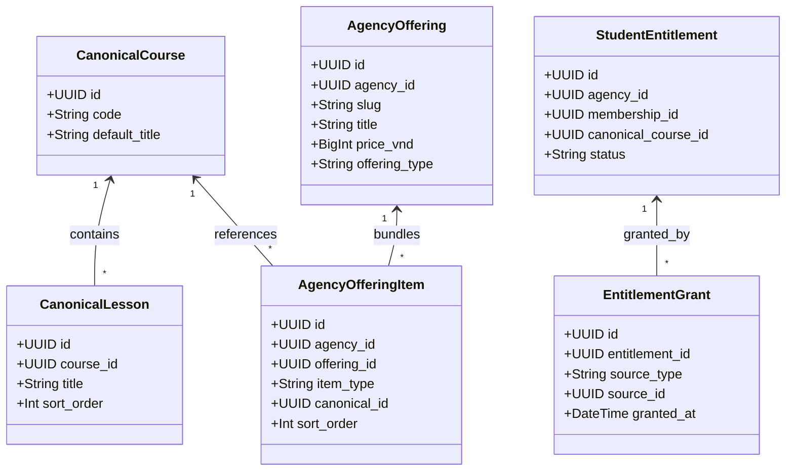

# SYSTEM B — MULTI-AGENCY MASTER IMPLEMENTATION PLAN (V1.1)
**Authoritative Architectural Specification & Rollout Roadmap for Agency A, B, and C**

**Document Version**: `1.1.0-AUTHORITATIVE`  
**Date**: `2026-09-26`  
**Classification**: `CONFIDENTIAL / MASTER ARCHITECTURAL PLAN`  
**Status**: `READY_FOR_OWNER_APPROVAL`  
**Baseline Recovery Checkpoint**: `SYSTEM_B_CURRENT_PRE_MULTI_AGENCY_20260926T031000Z` (`RESTORE_DRILL_PASS = YES`)  
**Data Classification**: `CURRENT_BUSINESS_DATA_CLASSIFICATION = TEST_ONLY` (`OWNER_ALLOWS_FULL_TEST_DATA_RESET = YES`)  

---

## 0. OWNER_REVIEW_CORRECTIONS_APPLIED

This revision incorporates the following 10 mandatory corrections directed by the Owner following review of Plan v1.0:

1. **Preserve Existing V5 Media Architecture as Shared Platform Service**:
   - Explicitly eliminated all plans to alter or redesign the V5 playback protocol, R2 bucket, R2 object layout, transcoding pipeline, Cloudflare Worker architecture, or EC P-256 cryptographic lease/proof mechanics.
   - Preserved current verified V5 media/playback system intact. Multi-Agency introduces only a minimal authorization bridge (`v5_authorize_agency_playback`). Canonical media remains stored once.
2. **Re-Sequenced Milestone 0 to Prevent Premature Legacy Retirement**:
   - Re-sequenced Milestone 0 into 5 distinct phases: **M0A** (Additive schema on Main), **M0B** (Application adaptation), **M0C** (Agency A provisioning), **M0D** (Agency A end-to-end verification without Legacy), and **M0E** (Formal decommissioning of Legacy Supabase only after M0D passes).
3. **Established Trusted Tenant Context & Removed Spoofable Headers**:
   - Hardened edge/server ingress to strip incoming client tenant headers (`x-agency-id`, query parameters).
   - Tenant identity is derived exclusively from trusted server-side hostname mapping, verified user memberships, and transaction-bound server RPC context. PostgreSQL session settings are explicitly forbidden from being the sole security boundary across serverless connection poolers.
4. **Redesigned Commercial Offering & Packaging Model**:
   - Decoupled `agency_offerings` from a rigid 1:1 mapping with canonical courses.
   - Introduced `agency_offering_items` to natively support bundles, multi-course packages, standalone masterclasses, and future module/lesson subsets, while allowing multiple distinct offerings to reference the same canonical course.
5. **Enforced Database-Level Tenant Consistency (Composite Constraints)**:
   - Added composite unique keys and composite foreign keys `(agency_id, ...)` across all tenant relationships (`order_items`, `student_entitlements`, `lesson_progress`, `student_devices`) so tenant mismatches are rejected by the database kernel even if application code fails.
   - Replaced destructive `ON DELETE CASCADE` with `ON DELETE RESTRICT` / archival status on financial, order, and audit entities.
6. **Architected Multi-Surface UI Variant Engine**:
   - Replaced simple logo/color theming with `agency_ui_profiles` supporting distinct component layouts and design systems per agency for Storefront, Checkout, Admin, Learner Portal, Video Player, and Homework modules, without forking business logic.
7. **Corrected RLS Policy Language & Acceptance Invariants**:
   - Clarified that the "100% RLS" requirement applies specifically to all **tenant-scoped tables** (with `FORCE ROW LEVEL SECURITY` and default-deny).
   - Global platform tables (`canonical_courses`, `v5_media_assets`, `agencies`) maintain explicit platform-appropriate access controls.
8. **Removed Unverified Seed Counts**:
   - Removed hardcoded "8 canonical courses, 42 canonical lessons" targets. Canonical curriculum references will be mapped directly from existing verified V5 media/release snapshots on Main Supabase.
9. **Decoupled Future Entitlement & Grant Sources**:
   - Designed a dedicated `student_entitlements` and `entitlement_grants` architecture allowing access to originate from purchases, manual admin grants, promotions, bundles, cross-agency transfers, platform grants, and external webhooks.
10. **Added Tenant Data-Access Abstraction for Future Dedicated Extraction**:
    - Architected a `TenantDbResolver` interface within application services so Agency B (or future enterprise partners) can be extracted to a dedicated Supabase project or dedicated storage in the future with zero changes to business logic.

---

## 1. Executive Summary & Core Architectural Principles

System B is transitioning from a cloned, single-tenant deployment into a high-performance multi-tenant platform. The architecture supports **Agency A** (Yêu Nấu Ăn / Yêu Bếp baseline), **Agency B** (first validation partner), and subsequent partners (commencing with **Agency C**).

### North Star Principles

1. **Shared Canonical Content Core vs. Isolated Tenant Periphery**:
   - Master course curriculum and high-resolution V5 HLS video assets on Cloudflare R2 are encoded, secured, and stored **once** globally.
   - Agencies commercialize content through **Agency Offerings** with custom pricing, packaging, storefront presentation, payment channels, and distinct UI layouts.
2. **Zero-Trust Multi-Tenancy**:
   - Tenant isolation is enforced at the database level using PostgreSQL Row-Level Security (RLS) on all tenant tables, supplemented by composite foreign keys `(agency_id, ...)` to ensure relational consistency.
   - Client-provided tenant identifiers are untrusted. Ingress resolves tenant context exclusively from verified hostname bindings.
3. **Preservation of Battle-Tested V5 Media Infrastructure**:
   - The existing Cloudflare Worker video proxy, EC P-256 lease signing protocol, client Web Crypto device proof, and R2 object layout are treated as an existing, immutable shared platform service. Multi-Agency introduces only an authorization bridge.
4. **Safe Phased Cutover (No Premature Decommissioning)**:
   - Milestone 0 creates the multi-agency schema additively on Main Supabase (`yyiavtiwtekkocqpephr`). Legacy Supabase (`aqozjkfwzmyfunqvcyjv`) is decommissioned **only** after Agency A is proven fully operational across all paths.
5. **Extensibility for Enterprise Sovereignty**:
   - Shared-infrastructure-first, but built with a clean data-access abstraction layer allowing high-volume agencies to be extracted to dedicated infrastructure seamlessly in the future.

---

## 2. Target Architecture Overview

```
                      +---------------------------------------+
                      |         Public DNS / Cloudflare       |
                      +---------------------------------------+
                           |              |              |
                    agency-a.live   agency-b.com   agency-c.vn
                           \              |              /
                            v             v             v
             +------------------------------------------------------+
             |             Edge Ingress & Tenant Resolver           |
             |       (Next.js Edge Middleware / Reverse Proxy)      |
             |  1. STRIP incoming x-agency-id / tenant headers      |
             |  2. Lookup Hostname -> Verified agency_id (Cached)   |
             |  3. Inject trusted internal headers                  |
             +------------------------------------------------------+
                                     |
       +-----------------------------+-----------------------------+
       |                                                           |
       v                                                           v
+-----------------------------+             +-------------------------------+
|     Storefront & Checkout   |             |    LMS & Learning Portal      |
|  (yeunauan-commerce-clone)  |             |      (yeunauan-lms-clone)     |
| - Multi-Surface UI Engine   |             | - Multi-Surface UI Engine     |
|   (storefront_variant)      |             |   (learner & player variants) |
| - Dynamic Offering Bundles  |             | - Scoped Student Portal       |
| - Agency Dedicated VietQR   |             | - Agency Admin Portal         |
| - TenantDbResolver Client   |             | - V5 Authorization Bridge     |
+-----------------------------+             +-------------------------------+
       \                                                           /
        \                                                         /
         v                                                       v
      +-------------------------------------------------------------+
      |               Main Supabase Database Cluster                |
      |                 (Project: yyiavtiwtekkocqpephr)             |
      |                                                             |
      |  [Global Platform Core]        [Tenant-Isolated Partitions] |
      |  - agencies                    - agency_offerings (RLS)     |
      |  - agency_domains              - agency_offering_items(RLS) |
      |  - agency_ui_profiles          - agency_bank_accounts (RLS) |
      |  - canonical_courses           - orders & order_items (RLS) |
      |  - canonical_lessons           - student_entitlements (RLS) |
      |  - v5_media_assets             - entitlement_grants (RLS)   |
      |  - v5_releases                 - lesson_progress (RLS)      |
      |  - platform_admins             - student_devices (RLS)      |
      +-------------------------------------------------------------+
                                     |
                                     | (Authorized Asset Metadata)
                                     v
      +-------------------------------------------------------------+
      |              Existing V5 Media Platform Service             |
      |                                                             |
      |  Cloudflare R2 Bucket: yeubep-system-b-media                |
      |  - Path: /v5/releases/{release_id}/* (Immutable HLS Chunks) |
      |                                                             |
      |  Cloudflare Worker: V5_MEDIA_PUBLIC_URL                     |
      |  - Validates EC P-256 ECDSA Lease Signature                 |
      |  - Validates Client Web Crypto Device Proof Key             |
      |  - Streams Encrypted HLS Segments directly to Player        |
      +-------------------------------------------------------------+
```

---

## 3. Trusted Tenant Context & Security Boundaries

### 3.1 Trust Boundary Invariants

```
[ UNTRUSTED ZONE: Browser / Client ]
  - Host header: "agency-b.com"
  - Inbound HTTP request (may contain forged x-agency-id, cookies, query params)
               |
               v  [ TRUST BOUNDARY: Edge Middleware ]
  1. STRIP any incoming `x-agency-id`, `x-agency-slug`, or `x-tenant-*` headers.
  2. Normalize `req.headers.host` (e.g., `agency-b.com`).
  3. Query Trusted In-Memory / Redis Domain Cache:
     - `agency-b.com` -> `{ agency_id: "b0eebc99-...", status: "active" }`
     - If domain unrecognized or inactive: Terminate with HTTP 404/403.
  4. Inject verified, server-only internal headers for downstream routing:
     - `x-trusted-agency-id`: `b0eebc99-...`
               |
               v  [ TRUSTED ZONE: Server Application Layer ]
  5. Authenticate User JWT via Supabase Auth.
  6. Verify user membership in `x-trusted-agency-id`:
     - Student: Must hold active record in `agency_memberships` for this agency.
     - Admin: Must hold `agency_owner` or `agency_staff` role for this agency.
  7. Establish Database Context:
     - Execute queries via server-bound RPC or pass verified `p_agency_id` parameter.
     - Never rely solely on pooled session settings across serverless transactions.
```

---

## 4. Decoupled Commercial Offering & Entitlement Model

To support bundles, single courses, future lesson modules, and multiple commercial packages referencing the same curriculum:



### Supported Commercial Packaging Modes

1. **Standard Single Course**: Offering contains exactly 1 item (`item_type = 'canonical_course'`).
2. **Multi-Course Bundle**: Offering contains $N$ items referencing different canonical courses (e.g. "Combo Bếp Á + Bếp Âu" at a bundled price).
3. **Multi-Tier Offerings**: An agency can create multiple offerings for the same canonical course (e.g. "Khóa Tiêu Chuẩn" at 499k VND and "Khóa VIP + Mentoring" at 1,499k VND).
4. **Future Granular Subsets**: `item_type = 'canonical_lesson'` or `'canonical_module'` allowing targeted micro-credentials.

---

## 5. Database Consistency & Normalized DDL (Main Supabase)

All tenant-scoped tables enforce composite unique keys and composite foreign keys to guarantee relational integrity at the PostgreSQL engine level:

```sql
-- =============================================================================
-- SYSTEM B MULTI-AGENCY DDL V1.1 (MAIN SUPABASE: yyiavtiwtekkocqpephr)
-- =============================================================================

CREATE EXTENSION IF NOT EXISTS "uuid-ossp";
CREATE EXTENSION IF NOT EXISTS "pgcrypto";

-- -----------------------------------------------------------------------------
-- 1. PLATFORM REGISTRY & DOMAINS
-- -----------------------------------------------------------------------------
CREATE TABLE public.agencies (
    id UUID PRIMARY KEY DEFAULT gen_random_uuid(),
    slug TEXT NOT NULL UNIQUE,
    name TEXT NOT NULL,
    status TEXT NOT NULL DEFAULT 'active' CHECK (status IN ('active', 'suspended', 'archived')),
    created_at TIMESTAMPTZ NOT NULL DEFAULT now(),
    updated_at TIMESTAMPTZ NOT NULL DEFAULT now()
);

CREATE TABLE public.agency_domains (
    id UUID PRIMARY KEY DEFAULT gen_random_uuid(),
    agency_id UUID NOT NULL REFERENCES public.agencies(id) ON DELETE RESTRICT,
    hostname TEXT NOT NULL UNIQUE,
    is_primary BOOLEAN NOT NULL DEFAULT false,
    ssl_status TEXT NOT NULL DEFAULT 'active' CHECK (ssl_status IN ('pending', 'active', 'failed')),
    created_at TIMESTAMPTZ NOT NULL DEFAULT now()
);
CREATE INDEX idx_agency_domains_lookup ON public.agency_domains(hostname);

-- -----------------------------------------------------------------------------
-- 2. AGENCY MULTI-SURFACE UI PROFILES
-- -----------------------------------------------------------------------------
CREATE TABLE public.agency_ui_profiles (
    agency_id UUID PRIMARY KEY REFERENCES public.agencies(id) ON DELETE RESTRICT,
    brand_name TEXT NOT NULL,
    logo_url TEXT,
    favicon_url TEXT,
    storefront_variant TEXT NOT NULL DEFAULT 'classic_culinary',
    checkout_variant TEXT NOT NULL DEFAULT 'one_page_qr',
    admin_variant TEXT NOT NULL DEFAULT 'standard_agency',
    learner_variant TEXT NOT NULL DEFAULT 'card_dashboard',
    learning_variant TEXT NOT NULL DEFAULT 'cinema_player',
    homework_variant TEXT NOT NULL DEFAULT 'photo_submission',
    design_tokens JSONB NOT NULL DEFAULT '{
        "primary_color": "#e11d48",
        "secondary_color": "#4b5563",
        "font_family": "Inter, sans-serif",
        "border_radius": "8px"
    }'::jsonb,
    feature_flags JSONB NOT NULL DEFAULT '{
        "enable_reviews": true,
        "enable_device_lock": true,
        "enable_community": false
    }'::jsonb,
    created_at TIMESTAMPTZ NOT NULL DEFAULT now(),
    updated_at TIMESTAMPTZ NOT NULL DEFAULT now()
);

-- -----------------------------------------------------------------------------
-- 3. AGENCY BANK ACCOUNTS (COMMERCIAL ROUTING)
-- -----------------------------------------------------------------------------
CREATE TABLE public.agency_bank_accounts (
    id UUID DEFAULT gen_random_uuid(),
    agency_id UUID NOT NULL REFERENCES public.agencies(id) ON DELETE RESTRICT,
    bank_code TEXT NOT NULL,
    account_number TEXT NOT NULL,
    account_holder TEXT NOT NULL,
    branch TEXT,
    is_active BOOLEAN NOT NULL DEFAULT true,
    created_at TIMESTAMPTZ NOT NULL DEFAULT now(),
    PRIMARY KEY (agency_id, id)
);

-- -----------------------------------------------------------------------------
-- 4. CANONICAL CURRICULUM & V5 MEDIA (GLOBAL SHARED CORE)
-- -----------------------------------------------------------------------------
CREATE TABLE public.canonical_courses (
    id UUID PRIMARY KEY DEFAULT gen_random_uuid(),
    code TEXT NOT NULL UNIQUE,
    default_title TEXT NOT NULL,
    curriculum_metadata JSONB DEFAULT '{}'::jsonb,
    status TEXT NOT NULL DEFAULT 'published' CHECK (status IN ('draft', 'published', 'archived')),
    created_at TIMESTAMPTZ NOT NULL DEFAULT now(),
    updated_at TIMESTAMPTZ NOT NULL DEFAULT now()
);

CREATE TABLE public.canonical_lessons (
    id UUID PRIMARY KEY DEFAULT gen_random_uuid(),
    course_id UUID NOT NULL REFERENCES public.canonical_courses(id) ON DELETE RESTRICT,
    title TEXT NOT NULL,
    sort_order INT NOT NULL DEFAULT 0,
    is_free_preview BOOLEAN NOT NULL DEFAULT false,
    duration_seconds INT DEFAULT 0,
    created_at TIMESTAMPTZ NOT NULL DEFAULT now(),
    UNIQUE (course_id, sort_order)
);

-- Existing V5 Media References (Reused Unchanged)
CREATE TABLE public.v5_media_assets (
    id UUID PRIMARY KEY DEFAULT gen_random_uuid(),
    type TEXT NOT NULL,
    provider TEXT NOT NULL DEFAULT 'r2',
    r2_object_key TEXT NOT NULL UNIQUE,
    mime_type TEXT NOT NULL,
    original_filename TEXT NOT NULL,
    bytes BIGINT NOT NULL,
    status TEXT NOT NULL DEFAULT 'ready',
    created_at TIMESTAMPTZ NOT NULL DEFAULT now()
);

CREATE TABLE public.v5_releases (
    id UUID PRIMARY KEY DEFAULT gen_random_uuid(),
    course_id UUID NOT NULL REFERENCES public.canonical_courses(id) ON DELETE RESTRICT,
    release_tag TEXT NOT NULL,
    snapshot_manifest JSONB NOT NULL,
    is_active BOOLEAN NOT NULL DEFAULT true,
    created_at TIMESTAMPTZ NOT NULL DEFAULT now(),
    UNIQUE (course_id, release_tag)
);

-- -----------------------------------------------------------------------------
-- 5. AGENCY OFFERINGS & OFFERING ITEMS (DECOUPLED PACKAGING)
-- -----------------------------------------------------------------------------
CREATE TABLE public.agency_offerings (
    id UUID DEFAULT gen_random_uuid(),
    agency_id UUID NOT NULL REFERENCES public.agencies(id) ON DELETE RESTRICT,
    slug TEXT NOT NULL,
    display_title TEXT NOT NULL,
    display_description TEXT,
    thumbnail_url TEXT,
    price_vnd BIGINT NOT NULL DEFAULT 0,
    sale_price_vnd BIGINT,
    is_published BOOLEAN NOT NULL DEFAULT false,
    sort_order INT NOT NULL DEFAULT 0,
    created_at TIMESTAMPTZ NOT NULL DEFAULT now(),
    updated_at TIMESTAMPTZ NOT NULL DEFAULT now(),
    PRIMARY KEY (agency_id, id),
    UNIQUE (agency_id, slug)
);

CREATE TABLE public.agency_offering_items (
    id UUID DEFAULT gen_random_uuid(),
    agency_id UUID NOT NULL,
    offering_id UUID NOT NULL,
    item_type TEXT NOT NULL CHECK (item_type IN ('canonical_course', 'canonical_lesson', 'bundle_package')),
    canonical_id UUID NOT NULL,
    sort_order INT NOT NULL DEFAULT 0,
    created_at TIMESTAMPTZ NOT NULL DEFAULT now(),
    PRIMARY KEY (agency_id, id),
    FOREIGN KEY (agency_id, offering_id) REFERENCES public.agency_offerings(agency_id, id) ON DELETE CASCADE
);
CREATE INDEX idx_offering_items_canonical ON public.agency_offering_items(canonical_id);

-- -----------------------------------------------------------------------------
-- 6. TENANT USERS, MEMBERSHIPS & DEVICE LOCKS
-- -----------------------------------------------------------------------------
CREATE TABLE public.agency_memberships (
    id UUID DEFAULT gen_random_uuid(),
    agency_id UUID NOT NULL REFERENCES public.agencies(id) ON DELETE RESTRICT,
    user_id UUID NOT NULL, -- references auth.users
    role TEXT NOT NULL DEFAULT 'student' CHECK (role IN ('agency_owner', 'agency_staff', 'student')),
    display_name TEXT NOT NULL,
    phone TEXT,
    status TEXT NOT NULL DEFAULT 'active' CHECK (status IN ('active', 'suspended', 'banned')),
    created_at TIMESTAMPTZ NOT NULL DEFAULT now(),
    PRIMARY KEY (agency_id, id),
    UNIQUE (agency_id, user_id),
    UNIQUE (agency_id, phone)
);

CREATE TABLE public.student_devices (
    id UUID DEFAULT gen_random_uuid(),
    agency_id UUID NOT NULL,
    membership_id UUID NOT NULL,
    device_fingerprint TEXT NOT NULL,
    device_name TEXT,
    last_ip TEXT,
    last_seen_at TIMESTAMPTZ NOT NULL DEFAULT now(),
    is_active BOOLEAN NOT NULL DEFAULT true,
    PRIMARY KEY (agency_id, id),
    UNIQUE (agency_id, membership_id, device_fingerprint),
    FOREIGN KEY (agency_id, membership_id) REFERENCES public.agency_memberships(agency_id, id) ON DELETE CASCADE
);

-- -----------------------------------------------------------------------------
-- 7. ORDERS & FINANCIAL TRANSACTIONS (COMPOSITE FOREIGN KEYS)
-- -----------------------------------------------------------------------------
CREATE TABLE public.orders (
    id UUID DEFAULT gen_random_uuid(),
    agency_id UUID NOT NULL REFERENCES public.agencies(id) ON DELETE RESTRICT,
    order_code TEXT NOT NULL UNIQUE,
    customer_name TEXT NOT NULL,
    customer_phone TEXT NOT NULL,
    customer_email TEXT,
    total_amount_vnd BIGINT NOT NULL,
    status TEXT NOT NULL DEFAULT 'pending' CHECK (status IN ('pending', 'completed', 'cancelled', 'refunded')),
    bank_account_id UUID,
    created_at TIMESTAMPTZ NOT NULL DEFAULT now(),
    updated_at TIMESTAMPTZ NOT NULL DEFAULT now(),
    PRIMARY KEY (agency_id, id),
    FOREIGN KEY (agency_id, bank_account_id) REFERENCES public.agency_bank_accounts(agency_id, id) ON DELETE SET NULL
);

CREATE TABLE public.order_items (
    id UUID DEFAULT gen_random_uuid(),
    agency_id UUID NOT NULL,
    order_id UUID NOT NULL,
    offering_id UUID NOT NULL,
    price_vnd BIGINT NOT NULL,
    quantity INT NOT NULL DEFAULT 1,
    created_at TIMESTAMPTZ NOT NULL DEFAULT now(),
    PRIMARY KEY (agency_id, id),
    FOREIGN KEY (agency_id, order_id) REFERENCES public.orders(agency_id, id) ON DELETE RESTRICT,
    FOREIGN KEY (agency_id, offering_id) REFERENCES public.agency_offerings(agency_id, id) ON DELETE RESTRICT
);

-- -----------------------------------------------------------------------------
-- 8. DECOUPLED STUDENT ENTITLEMENTS & MULTI-SOURCE GRANTS
-- -----------------------------------------------------------------------------
CREATE TABLE public.student_entitlements (
    id UUID DEFAULT gen_random_uuid(),
    agency_id UUID NOT NULL,
    membership_id UUID NOT NULL,
    canonical_course_id UUID NOT NULL REFERENCES public.canonical_courses(id) ON DELETE RESTRICT,
    status TEXT NOT NULL DEFAULT 'active' CHECK (status IN ('active', 'expired', 'revoked')),
    expires_at TIMESTAMPTZ,
    created_at TIMESTAMPTZ NOT NULL DEFAULT now(),
    PRIMARY KEY (agency_id, id),
    UNIQUE (agency_id, membership_id, canonical_course_id),
    FOREIGN KEY (agency_id, membership_id) REFERENCES public.agency_memberships(agency_id, id) ON DELETE RESTRICT
);

CREATE TABLE public.entitlement_grants (
    id UUID DEFAULT gen_random_uuid(),
    agency_id UUID NOT NULL,
    entitlement_id UUID NOT NULL,
    source_type TEXT NOT NULL CHECK (source_type IN (
        'order_purchase', 'manual_admin', 'promotion_code', 'bundle_package',
        'cross_agency_transfer', 'platform_grant', 'external_integration'
    )),
    source_reference_id TEXT, -- e.g. order_id, promo_id, admin_user_id
    notes TEXT,
    granted_at TIMESTAMPTZ NOT NULL DEFAULT now(),
    PRIMARY KEY (agency_id, id),
    FOREIGN KEY (agency_id, entitlement_id) REFERENCES public.student_entitlements(agency_id, id) ON DELETE RESTRICT
);

-- -----------------------------------------------------------------------------
-- 9. LEARNING PROGRESS & AUDIT LOGS
-- -----------------------------------------------------------------------------
CREATE TABLE public.lesson_progress (
    id UUID DEFAULT gen_random_uuid(),
    agency_id UUID NOT NULL,
    membership_id UUID NOT NULL,
    lesson_id UUID NOT NULL REFERENCES public.canonical_lessons(id) ON DELETE RESTRICT,
    progress_percent INT NOT NULL DEFAULT 0 CHECK (progress_percent BETWEEN 0 AND 100),
    is_completed BOOLEAN NOT NULL DEFAULT false,
    last_position_seconds INT NOT NULL DEFAULT 0,
    updated_at TIMESTAMPTZ NOT NULL DEFAULT now(),
    PRIMARY KEY (agency_id, id),
    UNIQUE (agency_id, membership_id, lesson_id),
    FOREIGN KEY (agency_id, membership_id) REFERENCES public.agency_memberships(agency_id, id) ON DELETE CASCADE
);

CREATE TABLE public.admin_audit_logs (
    id UUID PRIMARY KEY DEFAULT gen_random_uuid(),
    agency_id UUID REFERENCES public.agencies(id) ON DELETE SET NULL,
    actor_id UUID NOT NULL,
    action TEXT NOT NULL,
    entity_type TEXT NOT NULL,
    entity_id TEXT,
    payload JSONB DEFAULT '{}'::jsonb,
    ip_address TEXT,
    created_at TIMESTAMPTZ NOT NULL DEFAULT now()
);

-- =============================================================================
-- RLS ENFORCEMENT ON 100% OF TENANT-SCOPED TABLES
-- =============================================================================

ALTER TABLE public.agency_domains ENABLE ROW LEVEL SECURITY;
ALTER TABLE public.agency_ui_profiles ENABLE ROW LEVEL SECURITY;
ALTER TABLE public.agency_bank_accounts ENABLE ROW LEVEL SECURITY;
ALTER TABLE public.agency_offerings ENABLE ROW LEVEL SECURITY;
ALTER TABLE public.agency_offering_items ENABLE ROW LEVEL SECURITY;
ALTER TABLE public.agency_memberships ENABLE ROW LEVEL SECURITY;
ALTER TABLE public.student_devices ENABLE ROW LEVEL SECURITY;
ALTER TABLE public.orders ENABLE ROW LEVEL SECURITY;
ALTER TABLE public.order_items ENABLE ROW LEVEL SECURITY;
ALTER TABLE public.student_entitlements ENABLE ROW LEVEL SECURITY;
ALTER TABLE public.entitlement_grants ENABLE ROW LEVEL SECURITY;
ALTER TABLE public.lesson_progress ENABLE ROW LEVEL SECURITY;

ALTER TABLE public.agency_bank_accounts FORCE ROW LEVEL SECURITY;
ALTER TABLE public.orders FORCE ROW LEVEL SECURITY;
ALTER TABLE public.order_items FORCE ROW LEVEL SECURITY;
ALTER TABLE public.student_entitlements FORCE ROW LEVEL SECURITY;
ALTER TABLE public.entitlement_grants FORCE ROW LEVEL SECURITY;
```

---

## 6. Multi-Surface UI Variant & Layout Architecture

Agencies A, B, and C can display radically different layouts, typography, and page flows without forking the application core:

```
[ Inbound Request: agency-b.com ] 
             |
             v
 [ Resolve agency_ui_profiles ]
   - storefront_variant: "modern_grid"
   - checkout_variant:   "one_page_qr"
   - learner_variant:    "card_dashboard"
   - learning_variant:   "cinema_player"
   - design_tokens:      { primary: "#2563eb", radius: "12px" }
             |
             v
 [ Dynamic Component Dispatcher ]
   if (variant === 'classic_culinary') return <CulinaryStorefront />;
   if (variant === 'modern_grid')      return <ModernGridStorefront />;
```

### Component Registry Matrix

| Surface | Supported Variants | Customization Scope |
|---|---|---|
| **Storefront** | `classic_culinary`, `modern_grid`, `editorial_showcase` | Hero banners, course card aspect ratios, category carousels, testimonials. |
| **Checkout** | `one_page_qr`, `multi_step_express` | VietQR bank modal, customer note inputs, express phone-only checkout. |
| **Agency Admin** | `standard_agency`, `compact_pro` | Table densities, quick-enroll widgets, analytics summary cards. |
| **Learner Portal** | `card_dashboard`, `linear_curriculum` | Course progress meters, certificate showcases, recent lessons. |
| **Course Player** | `cinema_player`, `sidebar_notes_player` | Theater video sizing, sidebar notes tab, recipe ingredient checklist. |
| **Homework** | `photo_submission`, `graded_rubric` | Dish photo upload, chef evaluation ratings, feedback threads. |

---

## 7. Preserved V5 Media Architecture & Multi-Agency Bridge

### 7.1 Existing V5 Platform Assets Preserved Unchanged

1. **Cloudflare R2 Object Key Namespace**:
   Unchanged: `/v5/releases/{release_id}/hls/{asset_id}/*`. Canonical video chunks are never recopied or namespaced by agency.
2. **Cryptographic Lease Format (P-256 ECDSA)**:
   Unchanged: Signed with `V5_PLAYBACK_PRIVATE_JWK` using EC P-256 curve, targeting `V5_MEDIA_PUBLIC_URL`.
3. **Client Web Crypto Device Proof**:
   Unchanged: Client player generates an ephemeral P-256 public key, sends `x-v5-playback-key` header to authenticate device playback binding.
4. **Cloudflare Worker**:
   Unchanged: High-throughput streaming proxy validating token signatures and serving segments directly from R2.

### 7.2 Minimal Multi-Agency Authorization Bridge

To bridge tenant entitlement to existing V5 playback without touching playback code:

```sql
CREATE OR REPLACE FUNCTION public.v5_authorize_agency_playback(
    p_agency_id UUID,
    p_membership_id UUID,
    p_lesson_id UUID,
    p_asset_id UUID
) RETURNS JSONB AS $$
DECLARE
    v_course_id UUID;
    v_has_entitlement BOOLEAN;
    v_release_manifest JSONB;
BEGIN
    -- 1. Identify canonical course for this lesson
    SELECT course_id INTO v_course_id
    FROM public.canonical_lessons
    WHERE id = p_lesson_id;
    
    IF v_course_id IS NULL THEN
        RETURN jsonb_build_object('authorized', false, 'code', 'lesson_not_found');
    END IF;

    -- 2. Verify active student entitlement in this agency
    SELECT EXISTS (
        SELECT 1 FROM public.student_entitlements
        WHERE agency_id = p_agency_id
          AND membership_id = p_membership_id
          AND canonical_course_id = v_course_id
          AND status = 'active'
          AND (expires_at IS NULL OR expires_at > now())
    ) INTO v_has_entitlement;

    IF NOT v_has_entitlement THEN
        RETURN jsonb_build_object('authorized', false, 'code', 'entitlement_missing');
    END IF;

    -- 3. Verify asset is active in current release manifest
    SELECT snapshot_manifest INTO v_release_manifest
    FROM public.v5_releases
    WHERE course_id = v_course_id AND is_active = true;

    RETURN jsonb_build_object(
        'authorized', true,
        'course_id', v_course_id,
        'manifest', v_release_manifest
    );
END;
$$ LANGUAGE plpgsql SECURITY DEFINER;
```

---

## 8. Revised Milestone 0 Sequencing & Rollout Plan

To ensure zero risk of runtime disruption, Milestone 0 is re-sequenced into 5 strict stages:

```
+-----------------------------------------------------------------------------------+
| M0A: Additive Schema Foundation on Main Supabase                                  |
| - Deploy Multi-Agency DDL, composite constraints, and RLS policies on Main.      |
| - Populate canonical catalog & V5 media references from existing Main baseline.   |
| - Legacy Supabase remains untouched and operational for existing traffic.         |
+-----------------------------------------------------------------------------------+
                                         |
                                         v
+-----------------------------------------------------------------------------------+
| M0B: Adapt Application Layer to Tenant Context                                    |
| - Implement Edge tenant header stripping and trusted domain resolution.           |
| - Integrate TenantDbResolver in yeunauan-commerce-clone and yeunauan-lms-clone.   |
| - Implement multi-surface UI variant dispatcher.                                  |
+-----------------------------------------------------------------------------------+
                                         |
                                         v
+-----------------------------------------------------------------------------------+
| M0C: Provision & Test Agency A Baseline                                           |
| - Provision Agency A record (slug: 'yeunauan', primary_domain).                   |
| - Configure Agency A branding and UI profile ('classic_culinary').                |
| - Publish baseline offerings mapped to canonical courses.                         |
+-----------------------------------------------------------------------------------+
                                         |
                                         v
+-----------------------------------------------------------------------------------+
| M0D: Prove Agency A Zero-Legacy Independence                                      |
| - Verify Storefront, Checkout, Payment QR, Student Portal, Admin, and             |
|   V5 playback execute 100% on Main Supabase.                                      |
| - Temporarily firewall/disconnect Legacy DB locally to prove zero runtime leaks.  |
+-----------------------------------------------------------------------------------+
                                         |
                                         v
+-----------------------------------------------------------------------------------+
| M0E: Formal Legacy Decommissioning & Retirement                                   |
| - Remove legacy connection strings, legacy sync code, and legacy outbox jobs.     |
| - Permanently decommission Legacy Supabase (aqozjkfwzmyfunqvcyjv).               |
| - T06 security defect permanently eliminated.                                     |
+-----------------------------------------------------------------------------------+
                                         |
                                         v
+-----------------------------------------------------------------------------------+
| Milestone 1: Agency A Production Cutover & Baseline Stabilization                 |
| Milestone 2: Agency B Validation Rollout (Separate domain, brand, bank, offerings)|
| Milestone 3: Agency B Acceptance Sign-off & Automated Onboarding Tooling          |
| Milestone 4: Agency C Onboarding & Future Extraction Readiness                    |
+-----------------------------------------------------------------------------------+
```

---

## 9. Data Access Abstraction for Future Dedicated Extraction

The application services consume database connections via a `TenantDbResolver` abstraction. In shared mode, it routes to Main Supabase; when an enterprise agency requires dedicated infrastructure, only the resolver mapping is updated:

```typescript
// utils/tenant-db-resolver.js
import { createClient } from "@supabase/supabase-js";

interface TenantConfig {
  agencyId: string;
  supabaseUrl: string;
  supabaseKey: string;
}

const tenantRegistry = new Map<string, TenantConfig>();

export function getTenantDbClient(agencyId: string) {
  const config = tenantRegistry.get(agencyId);
  if (config) {
    // Dedicated Supabase Infrastructure (Future Agency B/C)
    return createClient(config.supabaseUrl, config.supabaseKey);
  }
  // Default Shared Supabase Cluster (Main: yyiavtiwtekkocqpephr)
  return createClient(
    process.env.MAIN_SUPABASE_URL!,
    process.env.MAIN_SUPABASE_ANON_KEY!
  );
}
```

---

## 10. Corrected RLS & Verification Acceptance Scorecard

| Check Item | Target Requirement | Acceptance Criteria |
|---|---|---|
| **Tenant Tables RLS** | 100% of tenant-scoped tables (12 tables) | `relrowsecurity = true`, `FORCE RLS` enabled, default-deny active. |
| **Global Platform Tables** | `canonical_courses`, `v5_media_assets`, `agencies` | Explicit platform access policies (read-only for learners, write for platform admins). |
| **T06 Defect Status** | `sync_outbox` / `sync_deliveries` with RLS OFF | **PERMANENTLY ELIMINATED.** Zero tables with RLS disabled. |
| **Legacy DB Retirement** | Legacy Supabase (`aqozjkfwzmyfunqvcyjv`) | Fully decommissioned at M0E (zero runtime calls from either repo). |
| **V5 Media Architecture** | Cloudflare Worker + R2 HLS segments | 100% preserved. Zero re-encoding, zero file re-uploading. |
| **Tenant Consistency** | Composite keys across all tenant relations | Database kernel rejects cross-agency foreign key insertions. |
| **Spoofing Guard** | Ingress header stripping | Incoming `x-agency-*` headers discarded; domain resolution verified. |

---

## 11. Final Status & Sign-Off

```ini
MASTER_PLAN_V1_1 = READY_FOR_OWNER_APPROVAL
NO_IMPLEMENTATION_EXECUTED = PASS
NO_PRODUCTION_MUTATION = PASS
```

**STOPPED.** Awaiting Owner formal approval of Plan V1.1 before beginning Milestone M0A.
