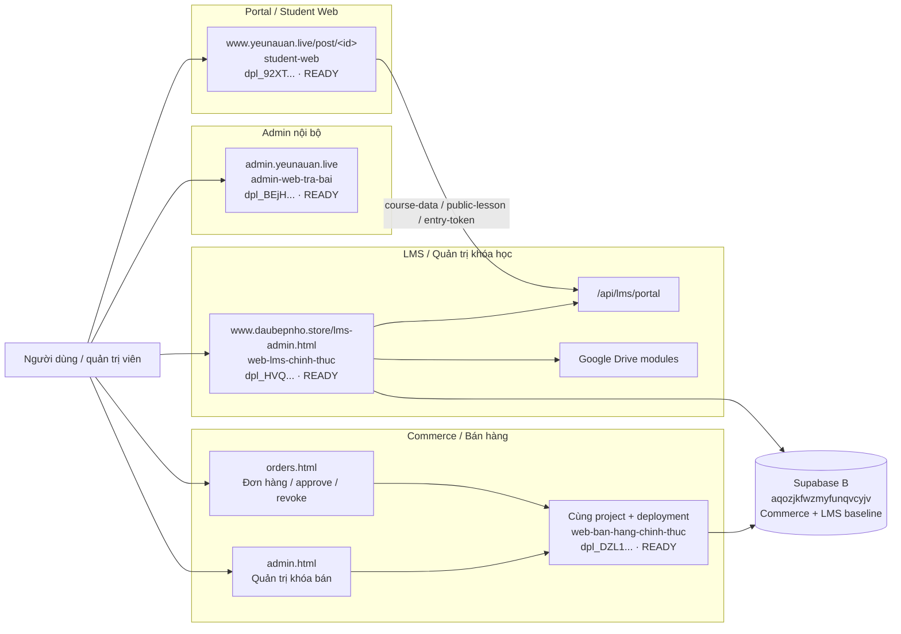
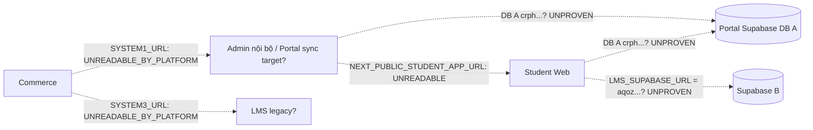

# Audit READ-ONLY kiến trúc năm URL hiện tại

**Thời điểm audit runtime:** 06/08/2026 11:25:05, Asia/Ho_Chi_Minh  
**Phạm vi:** Chỉ đọc HTTP/DNS, Vercel control plane, exact deployed source và
tài liệu hiện có. Không deploy, không đổi env/domain, không ghi database.

## A. Tóm tắt ngắn

- `admin.yeunauan.live` là **Admin nội bộ quản trị nội dung**, không phải Shop
  Admin và không phải LMS Admin. Đây là một Next.js project riêng tên
  `admin-web-tra-bai`.
- `www.yeunauan.live/post/<id>` là **Portal / Student Web**, dùng để học viên đọc
  bài/post, đăng nhập và đi tiếp sang LMS. Đây là Next.js project `student-web`.
- Admin nội bộ và Student Web nằm trong cùng repository
  `tao-web-tra-bai-hoc-vien`, nhưng là hai root directory, hai Vercel project và
  hai Production deployment khác nhau.
- `shop.yeunauan.live/admin.html` là **Commerce Admin**, quản trị dữ liệu khóa
  học bán hàng.
- `shop.yeunauan.live/orders.html` là **Commerce Orders Admin**, quản lý đơn,
  duyệt enrollment/revoke. Hai trang Commerce nằm trên cùng project, deployment
  và Supabase với nhau.
- `www.daubepnho.store/lms-admin.html` là **LMS Admin**, quản trị course, lesson,
  enrollment, media và Google Drive.
- Portal Student có kết nối được chứng minh trong exact source tới LMS legacy
  qua `/api/lms/portal` cho `course-data`, `public-lesson` và luồng entry-token.
- Commerce và LMS thuộc baseline Supabase B `aqozjkfwzmyfunqvcyjv`.
- Admin nội bộ và Student Web dùng contract Supabase Portal; tài liệu hiện có
  ghi DB A `crphwjizolsgghapyjjv`. Owner-level Production env pull xác nhận biến
  tồn tại nhưng platform trả empty/encrypted envelope, nên exact ref và việc hai
  deployment hiện cùng trỏ đúng DB A vẫn là `UNREADABLE_BY_PLATFORM`/`UNPROVEN`.

## B. Bảng mapping

| URL | Chức năng | Project / deployment hiện tại | Database / Supabase | Quan hệ với hệ khác | Trạng thái |
|---|---|---|---|---|---|
| `https://admin.yeunauan.live/` | Admin nội bộ; quản lý `posts`, thống kê `post_views`, import/upload và enrollment Portal | `admin-web-tra-bai`; `prj_dWBdKxCAiXmNHBS8oKDmzWatymKs`; `dpl_BEjH3DUJ1kHLLqevmGypXbmjyuSX`; Git `041a6dd...`; READY | Dùng `NEXT_PUBLIC_SUPABASE_URL` + service-role. DB A `crph...` được tài liệu hóa; exact runtime ref chưa đọc được | Source sinh link Student Web qua `NEXT_PUBLIC_STUDENT_APP_URL`; có inbound `/api/sync` | Project/path/source: xác minh. Exact DB ref và current student target: chưa xác minh runtime |
| `https://www.yeunauan.live/post/8d4844be-b2f2-4c4e-b086-67dd5211abb2` và `/post/<id>` | Portal / Student Web; hiển thị post, Google login, kiểm enrollment và LMS handoff | `student-web`; `prj_paRRXhaTAqF6NnqbZBK6HsZP4zm3`; `dpl_92XTh25gr74NznTbr6vJZDfMo5Mq`; Git `6ea837fa...`; READY | Có Portal Supabase client và LMS Supabase client. DB A `crph...` + DB B được tài liệu hóa; current raw env values không đọc được | Exact source gọi `www.daubepnho.store/api/lms/portal` và mặc định entry sang `www.daubepnho.store/lms.html` | Project/path/LMS API code: xác minh. Exact Supabase env pairing: chưa xác minh runtime |
| `https://shop.yeunauan.live/admin.html` | Commerce Admin; quản lý course/config bán hàng | `web-ban-hang-chinh-thuc`; `prj_tJOtibVVzl7FpliWzdk7bs1q9v7D`; `dpl_DZL1UNyUivz9BBNxPwG9fHGCVdW2`; Git `cafe21bb...`; READY | Supabase B `aqozjkfwzmyfunqvcyjv` | Khi sửa course, source có thể gọi `syncCourse` tới `SYSTEM1_URL` và `SYSTEM3_URL` | Project/deployment/DB/source: xác minh. Giá trị current sync targets: chưa xác minh |
| `https://shop.yeunauan.live/orders.html` | Commerce Orders Admin; xem đơn, approve, revoke, resync | Cùng project và deployment với `admin.html` | Cùng Supabase B `aqoz...` | Source gọi `syncEnrollment`/`revokeEnrollment` tới hai target cấu hình | Project/deployment/DB/source: xác minh. Giá trị current sync targets: chưa xác minh |
| `https://www.daubepnho.store/lms-admin.html` | LMS Admin; course, lesson, student, enrollment, progress, media, Drive | `web-lms-chinh-thuc`; `prj_TimQqrVhrOLW8y1KI464JBvajwlz`; `dpl_HVQvwrveFjxE81cpsoXRraDB34wR`; READY | Baseline Supabase B `aqozjkfwzmyfunqvcyjv` | Cung cấp `/api/lms/portal`, `/api/lms/admin`, `/api/sync`; source có Google Drive auth/upload/permission/repair/retry | Project/deployment/API/Drive module: xác minh. Git SHA không có trong Vercel metadata; Drive credential health chưa test |

## Bằng chứng routing hiện tại

| Host | Vercel project | Production deployment | HTTP/path evidence |
|---|---|---|---|
| `admin.yeunauan.live` | `admin-web-tra-bai` | `dpl_BEjH...` | 200; title “Hệ Thống Quản Trị - Cổng Trả Bài Học Viên” |
| `www.yeunauan.live` | `student-web` | `dpl_92XT...` | `/post/<id>` trả 200; title “Cổng Trả Bài Học Viên...” |
| `shop.yeunauan.live` | `web-ban-hang-chinh-thuc` | `dpl_DZL1...` | `admin.html` và `orders.html` đều 200 trên cùng host/project |
| `www.daubepnho.store` | `web-lms-chinh-thuc` | `dpl_HVQ...` | `lms-admin.html` trả 200; LMS Admin API không auth trả 401 JSON |

DNS của cả bốn host hiện resolve qua Vercel. Không có domain nào trong năm URL
được phát hiện route sang project khác với bảng trên.

## Runtime Pairing Verification

| Quan hệ | Trước audit | Sau audit | Evidence |
|---|---|---|---|
| Commerce `SYSTEM1_URL` → Admin/Portal | Chưa xác minh | `UNREADABLE_BY_PLATFORM` | Production env PRESENT, scope development+production, type encrypted/sensitive; pulled value là empty/encrypted envelope |
| Commerce `SYSTEM3_URL` → LMS legacy | Chưa xác minh | `UNREADABLE_BY_PLATFORM` | Production env PRESENT, scope development+production; không có diagnostic read-only trả effective target |
| Commerce secret ↔ Admin | Chưa xác minh | `UNPROVEN` | Cả hai biến PRESENT nhưng raw secret không readable; wrong-secret fixture bị Admin từ chối 401 |
| Commerce secret ↔ Student Portal | Chưa xác minh | `UNPROVEN` | Cả hai biến PRESENT nhưng raw secret không readable; wrong-secret fixture bị Student từ chối 401 |
| Commerce secret ↔ LMS legacy | Chưa xác minh | `UNPROVEN` | Cả hai biến PRESENT nhưng raw secret không readable; wrong-secret fixture bị LMS từ chối 401 |
| Admin `NEXT_PUBLIC_STUDENT_APP_URL` → `www.yeunauan.live` | Chưa xác minh | `UNREADABLE_BY_PLATFORM` | Biến PRESENT, preview+production, value bị platform che |
| Admin Portal Supabase ↔ Student Portal Supabase | Tài liệu ghi cùng DB A | `UNPROVEN` | Hai URL/key sets PRESENT; exact refs không readable. Không có safe unauth Admin DB marker endpoint |
| Student `LMS_SUPABASE_URL` → LMS `SUPABASE_URL` | Chưa xác minh | `UNPROVEN` | Hai biến PRESENT nhưng exact refs không readable |
| Student LMS API/base → `www.daubepnho.store` | Source evidence | `MATCH` | `LMS_ENTRY_BASE_URL` và `LMS_API_BASE_URL` NOT_CONFIGURED; exact deployed source dùng hard-code/fallback `www.daubepnho.store`; public-config trả 200 JSON |
| Commerce + LMS baseline DB B | Đã xác minh khi restore | `MATCH` | Current restore evidence + API smoke xác nhận baseline `aqozjkfwzmyfunqvcyjv` |

Không có `MISMATCH` được chứng minh. `UNREADABLE_BY_PLATFORM` không được diễn
giải thành empty configuration.

### Production env presence/scope

| Project | Variable | Scope | Result |
|---|---|---|---|
| Commerce | `SYSTEM1_URL`, `SYSTEM3_URL`, `INTERNAL_SYNC_SECRET` | development, production | PRESENT; `UNREADABLE_BY_PLATFORM` |
| Commerce | `SUPABASE_URL` | development, preview, production | PRESENT; `UNREADABLE_BY_PLATFORM` |
| Admin | `NEXT_PUBLIC_SUPABASE_URL`, service-role, `NEXT_PUBLIC_STUDENT_APP_URL`, `INTERNAL_SYNC_SECRET` | preview, production | PRESENT; `UNREADABLE_BY_PLATFORM` |
| Student | Portal Supabase URL/key, LMS Supabase URL/key, `INTERNAL_SYNC_SECRET` | preview, production | PRESENT; `UNREADABLE_BY_PLATFORM` |
| Student | `LMS_ENTRY_BASE_URL`, `LMS_API_BASE_URL` | — | `NOT_CONFIGURED` |
| LMS | `SUPABASE_URL`, `INTERNAL_SYNC_SECRET`, Google Client ID/Secret | preview, production | PRESENT; `UNREADABLE_BY_PLATFORM` |
| LMS | `PUBLIC_LMS_URL`, `GOOGLE_DRIVE_ROOT_FOLDER_ID` | — | `NOT_CONFIGURED` |

### Secret pairing matrix

| Pairing | Fingerprint | Result |
|---|---|---|
| Commerce ↔ Admin | Không tạo được từ raw value | `UNPROVEN` |
| Commerce ↔ Student | Không tạo được từ raw value | `UNPROVEN` |
| Commerce ↔ LMS | Không tạo được từ raw value | `UNPROVEN` |
| Admin ↔ Student | Không tạo được từ raw value | `UNPROVEN` |

Hai fingerprint từng xuất hiện trong các lần parser thử đầu tiên đã bị loại bỏ:
chúng là fingerprint của empty envelope do platform trả về, không phải
fingerprint của secret và không được dùng làm bằng chứng MATCH.

## Quan hệ backend đã chứng minh

### Commerce

Exact Commerce source:

- dùng Supabase cho `courses`, `orders` và config;
- `admin.html` gọi API course/config;
- `orders.html` gọi API order/approve/revoke;
- `syncCourse`, `syncEnrollment`, `revokeEnrollment` được gửi đến
  `SYSTEM1_URL` và `SYSTEM3_URL` qua `/api/sync` với internal secret;
- upload biên lai/media dùng Cloudinary.

Vercel xác nhận tên biến tồn tại, nhưng không cho đọc value. Do đó không vẽ mũi
tên đặc từ Commerce tới một hostname cụ thể chỉ dựa trên tên `SYSTEM1_URL` hoặc
`SYSTEM3_URL`.

### Admin nội bộ và Portal

Exact Admin source quản lý `posts`, `post_views`, `student_enrollments` và tạo
link `/post/<id>`. Exact Student source đọc `posts`, kiểm enrollment và dùng một
LMS Supabase client riêng. Cả hai có `/api/sync` và internal secret contract.

Tài liệu kiến trúc cũ ghi Admin + Student dùng chung DB A
`crphwjizolsgghapyjjv`. Source và env-name inventory phù hợp với thiết kế này,
nhưng Vercel che value của URL/key. Kết luận “current Admin và Student chắc chắn
cùng exact ref DB A” vì vậy chưa đạt mức authoritative runtime.

### Portal tới LMS

Exact deployed Student source `6ea837fa...` chứa:

- `https://www.daubepnho.store/api/lms/portal?endpoint=course-data`;
- `https://www.daubepnho.store/api/lms/portal?endpoint=public-lesson`;
- fallback entry URL `https://www.daubepnho.store/lms.html`;
- LMS Supabase client qua `LMS_SUPABASE_URL`.

Mũi tên Portal → LMS API vì vậy là quan hệ source/deployment đã chứng minh.
Exact current `LMS_SUPABASE_URL` value của Portal vẫn bị Vercel che.

### LMS và Google Drive

Exact LMS source có các handler:

- Drive OAuth/status;
- upload Google Drive video;
- cấp/revoke permission;
- sync permission;
- health, repair và retry queue.

Do audit không đăng nhập Admin và không thực hiện mutation, health của credential
Drive hiện tại và việc post cụ thể đang dùng file Drive nào là chưa xác minh.

Runtime read-only result:

- `drive-status`: 401 JSON khi không có Admin session;
- `drive-health`: 401 JSON khi không có Admin session;
- Google Client ID/Secret env names: PRESENT, value unreadable;
- `GOOGLE_DRIVE_ROOT_FOLDER_ID`: NOT_CONFIGURED ở Vercel env (root có thể nằm
  trong DB/config, không được suy luận là thiếu);
- sanitized snapshot ngay trước restore: 3 Drive Admin accounts, 59 permission
  logs, 9 queue rows;
- credential health: `UNPROVEN`;
- Drive root reachable: `UNPROVEN`;
- không refresh token, upload, repair, retry hoặc thay permission.

## Post cụ thể và media

Post `8d4844be-b2f2-4c4e-b086-67dd5211abb2`:

| Thuộc tính | Kết quả |
|---|---|
| HTTP | 200 |
| Post tồn tại | `MATCH` — UUID có trong SSR và trang không render marker “Không Tìm Thấy Bài Viết” |
| Database | Student Portal Supabase target; exact ref `UNREADABLE_BY_PLATFORM` |
| Google login gate | Có trong SSR công khai |
| Course mapping / LMS handoff của chính post | `UNPROVEN` — unauthenticated SSR không render nút “Bài học gốc” hoặc course marker |
| Media URL/provider | `UNPROVEN` — unauthenticated SSR không lộ media field/URL |
| Google Drive reference | Không quan sát thấy trong SSR công khai; không đủ bằng chứng kết luận row không có Drive media |

Audit không gọi view-count API bằng browser JavaScript, không tải file private và
không thay permission.

## C. Sơ đồ authoritative

Sơ đồ dưới đây chỉ dùng mũi tên đặc cho quan hệ đã có bằng chứng trực tiếp.

Source Mermaid độc lập: [diagram-current-architecture.mmd](diagram-current-architecture.mmd).

## Sơ đồ phụ — quan hệ cấu hình chưa xác minh runtime

Các đường dưới đây cố ý dùng nét đứt. Chúng tồn tại trong source/config contract
hoặc tài liệu cũ, nhưng exact Production env value hiện bị Vercel che.

## Luồng người dùng đã xác minh ở mức ứng dụng

1. Admin nội bộ mở `admin.yeunauan.live` để quản trị post/nội dung.
2. Học viên mở `www.yeunauan.live/post/<id>` để đọc post và đăng nhập Google khi
   nội dung yêu cầu enrollment.
3. Student Web có code gọi LMS legacy để lấy course/lesson hoặc tạo entry-token,
   sau đó người dùng đi tới LMS legacy.
4. Shop Admin quản lý khóa bán; Orders Admin quản lý đơn và thao tác approve/revoke.
5. LMS Admin quản lý nội dung học, học viên, enrollment và media/Drive.

Việc một lần approve cụ thể ở Production hiện đã gửi thành công tới cả Admin
nội bộ và LMS không được thử trong audit READ-ONLY này.

## Các điểm chưa chắc chắn / cần owner xác minh thêm

1. Exact Production value của Commerce `SYSTEM1_URL` và `SYSTEM3_URL`.
2. Exact Portal Supabase refs của Admin và Student và việc chúng cùng DB A.
3. Exact `LMS_SUPABASE_URL` của Student và việc nó match DB B `aqoz...`.
4. Exact `NEXT_PUBLIC_STUDENT_APP_URL` của Admin.
5. Internal-secret pairing giữa Commerce, Admin, Student và LMS.
6. LMS deployment `dpl_HVQ...` không cung cấp Git SHA trong Vercel metadata;
   source family có evidence nhưng exact artifact SHA chưa chứng minh từ metadata.
7. Google Drive credential/root hiện healthy/reachable hay không.
8. Course mapping, media provider và Drive reference trong row của post cụ thể.

Để đóng các điểm 1–6 mà không lộ secret, owner cần audit trong Vercel Dashboard
hoặc chạy local fingerprint/presence script có quyền đọc giá trị. Không gửi raw
value qua chat hoặc báo cáo.

## Tài sản tồn tại nhưng chưa chứng minh nằm trong luồng chính

Không đưa các tài sản sau vào sơ đồ authoritative của năm URL:

- `web-ban-hang-yeubep-shop`;
- `lms.yeubep.shop`;
- `student-portal-yeubep` / `portal.yeubep.shop`;
- `student-portal-yeunauan` / `portal.yeunauan.live`;
- các Preview/multisite/dual-LMS worktree và deployment.

Chúng tồn tại nhưng audit này không tìm được bằng chứng rằng năm URL được yêu cầu
đang route Production qua chúng.

## Kết luận

Năm URL thuộc bốn project Vercel: Admin nội bộ, Student Portal, Commerce và LMS.
Hai trang `shop.yeunauan.live/*.html` là hai giao diện của cùng một Commerce
artifact. Portal `/post/<id>` có tích hợp trực tiếp đã chứng minh bằng source tới
LMS legacy. Commerce và LMS thuộc baseline Supabase B. Admin nội bộ và Student
Portal được thiết kế dùng DB A, nhưng exact current runtime pairing chưa thể đọc
từ Vercel nên không được khẳng định tuyệt đối trong sơ đồ authoritative.

**Xác nhận:** Không deploy, không sửa env/domain/code, không gọi mutation API và
không ghi database hoặc mutate Drive trong audit này. Raw env/secret không được
in hoặc lưu; temp env files và audit salt đã bị hủy.

**Final status:** `PARTIAL RUNTIME PAIRING VERIFIED`.
