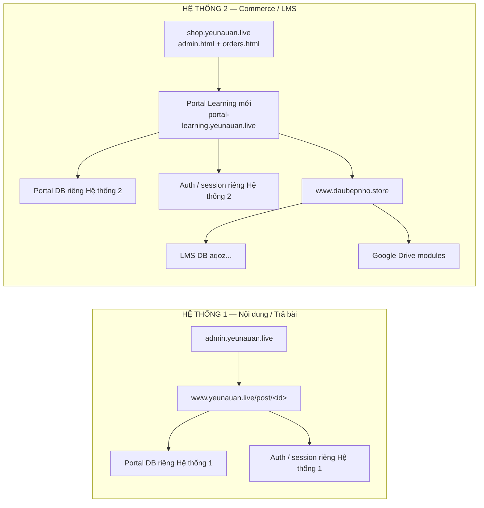

# Hồ sơ chuẩn bị tách hai hệ thống độc lập

**Thời điểm bằng chứng runtime:** 06/08/2026, Asia/Ho_Chi_Minh  
**Trạng thái:** `STOPPED — DATA BOUNDARY NOT PROVEN`  
**Phạm vi đã thực hiện:** inventory/read-only, kiểm tra gate backup, thiết kế và
runbook. Không tạo Portal/DB mới vì backup Hệ thống 1 chưa đạt.

## 1. Kết luận điều hành

Hệ thống Production hiện vẫn hoạt động bình thường. Bốn deployment phục vụ năm
URL được yêu cầu đều `READY`; cả năm path đều trả HTTP 200 tại thời điểm audit.

## 1. Kết luận điều hành

Hệ thống Production hiện vẫn hoạt động bình thường:
- `admin.yeunauan.live` (deployment `dpl_BEjH3DUJ1kHLLqevmGypXbmjyuSX` — READY / HTTP 200 tại `/login`);
- `www.yeunauan.live/post/8d4844be-b2f2-4c4e-b086-67dd5211abb2` (deployment `dpl_92XTh25gr74NznTbr6vJZDfMo5Mq` — READY / HTTP 200).

Owner đã xác nhận trên Supabase Dashboard exact project ref của Portal DB Hệ thống 1:
`crphwjizolsgghapyjjv` (chứa các bảng `posts`, `post_views`, `student_enrollments`, `gated_posts_access`).

Chưa thể tạo fresh encrypted backup và readback tự động vì API credential (service-role key / anon key) của ref `crphwjizolsgghapyjjv` chưa có sẵn trong môi trường CLI local. Theo chỉ thị fail-closed, dừng lại tại gate này và bảo vệ tuyệt đối Hệ thống 1 (0 mutation, 0 deploy, 0 env change).

## 2. BASELINE INVENTORY

### 2.1 Active Production

| Thành phần | Domain/path | Vercel project | Project ID | Known-good deployment | HTTP | Trạng thái |
|---|---|---|---|---|---:|---|
| Admin nội dung | `admin.yeunauan.live/` | `admin-web-tra-bai` | `prj_dWBdKxCAiXmNHBS8oKDmzWatymKs` | `dpl_BEjH3DUJ1kHLLqevmGypXbmjyuSX` | 200 | ACTIVE PRODUCTION / READY |
| Student Portal hiện tại | `www.yeunauan.live/post/<id>` | `student-web` | `prj_paRRXhaTAqF6NnqbZBK6HsZP4zm3` | `dpl_92XTh25gr74NznTbr6vJZDfMo5Mq` | 200 | ACTIVE PRODUCTION / READY |
| Commerce Admin | `shop.yeunauan.live/admin.html` | `web-ban-hang-chinh-thuc` | `prj_tJOtibVVzl7FpliWzdk7bs1q9v7D` | `dpl_DZL1UNyUivz9BBNxPwG9fHGCVdW2` | 200 | ACTIVE PRODUCTION / READY |
| Commerce Orders | `shop.yeunauan.live/orders.html` | cùng project Commerce | cùng ID | cùng deployment | 200 | ACTIVE PRODUCTION / READY |
| LMS Admin | `www.daubepnho.store/lms-admin.html` | `web-lms-chinh-thuc` | `prj_TimQqrVhrOLW8y1KI464JBvajwlz` | `dpl_HVQvwrveFjxE81cpsoXRraDB34wR` | 200 | ACTIVE PRODUCTION / READY |

Vercel team: `team_cAthcmyw4079BDgelX0YjG9i`.

### 2.2 Source identity

| Thành phần | Source evidence | Mức chứng minh |
|---|---|---|
| Admin | `041a6dd404f8f5543f2893ced943b236890429ee` | Git identity từ deployment audit trước, project/deployment hiện tại không đổi |
| Student Portal | `6ea837fadf85e7e94f410e38163d58077a9fd895` | Git identity từ deployment audit trước, project/deployment hiện tại không đổi |
| Commerce | `cafe21bbe55af86bfb8ac2ebe9155ded849452e8` | Exact Production source đã đối chiếu khi restore |
| LMS legacy | source family `044519300131745bf0e99a98ff152dd2c8afcc92` | Artifact family được đối chiếu; Vercel metadata hiện không trả exact Git SHA |

### 2.3 Existing isolated assets

| Asset | Project ID | Production URL | Phân loại | Quyết định |
|---|---|---|---|---|
| `student-portal-yeubep` | `prj_MHZCOD60wqFgyUS44yoO7krqzb9r` | không có | ISOLATED ASSET | Không tự tái sử dụng |
| `student-portal-yeunauan` | `prj_tzL3Hn1KBlkFuLbaGbm7YCiEdPMd` | không có | ISOLATED ASSET | Không tự tái sử dụng |

Hai asset trên không được nối vào sơ đồ authoritative và không được coi là
Portal Learning mới nếu chưa audit source, DB, env và secret boundary riêng.

### 2.4 Production environment-name inventory

Chỉ tên/scope được đọc; values vẫn encrypted/unreadable.

| Project | Nhóm biến liên quan đã xác nhận PRESENT |
|---|---|
| Admin | Portal Supabase URL/anon/service-role; `NEXT_PUBLIC_STUDENT_APP_URL`; `INTERNAL_SYNC_SECRET`; LMS Supabase URL/service-role |
| Student | Portal Supabase URL/anon/service-role; LMS Supabase URL/service-role; `SESSION_SECRET`; `INTERNAL_SYNC_SECRET`; `ACCOUNT_EVENT_HASH_SECRET`; Google Client ID |
| Commerce | `SYSTEM1_URL`; `SYSTEM3_URL`; Commerce Supabase URL/service-role; `INTERNAL_SYNC_SECRET`; Google/Cloudinary/Admin variables |
| LMS | LMS Supabase URL/service-role; `SESSION_SECRET`; `INTERNAL_SYNC_SECRET`; Google client ID/secret; V2 feature flags; `SYSTEM1_URL` |

Không fingerprint secret vì Vercel không trả raw value. `UNREADABLE_BY_PLATFORM`
không được diễn giải thành rỗng hoặc MATCH.

## 3. SYSTEM 1 PROTECTION REPORT

### 3.1 Known-good anchors

- Admin rollback anchor: `dpl_BEjH3DUJ1kHLLqevmGypXbmjyuSX`.
- Student Portal rollback anchor: `dpl_92XTh25gr74NznTbr6vJZDfMo5Mq`.
- Post canary read-only:
  `8d4844be-b2f2-4c4e-b086-67dd5211abb2` trả 200.
- DNS của `admin.yeunauan.live` và `www.yeunauan.live` vẫn đi qua Vercel.
- Unauthorized internal sync probes từ audit trước trả 401; không gọi mutation.

### 3.2 Invariants phải giữ

1. Hai domain, hai project và hai deployment trên không đổi.
2. Không thay env, OAuth origin, schema hoặc secret của Hệ thống 1.
3. Không ghi `posts`, `post_views`, students, enrollments, sessions/tokens hoặc
   mappings.
4. Không dùng post/học viên/enrollment thật làm fixture.
5. Sau mỗi mutation tài sản Hệ thống 2 phải so lại deployment IDs, HTTP 200 và
   count/checksum nguồn.

### 3.3 Protection result

`PASS` cho routing/deployment/HTTP baseline.  
`UNPROVEN` cho exact Portal DB identity và fresh database checksum. Đây là lý do
không cho phép mutation tiếp theo.

## 4. BACKUP AND CHECKSUM REPORT

### 4.1 Backup Commerce/LMS hiện có

Backup gần nhất đã kiểm chứng:

`C:\Users\gaomi\Downloads\Telegram Desktop\web-ban-hang-chinh-thuc\_private_backups\pre-multistore-restore-20260806-095716`

| Artifact | SHA-256 |
|---|---|
| `current-public-data-schema.json.aesgcm` | `38456e5a113a11cddffc5a48a558ca2b288ad9172aa2f07447356fdca014c18f` |
| `current-public-data-schema.key.dpapi` | `15b36f4865a54807db4b467ac8c3f3460bbe94ccfcdd4d76cc0c6928ffbdb83b` |
| `manifest-sanitized.json` | `dc33e120c30e768b7278e23623c7f16b05a6073ead99924cc29672a594cca802` |

Manifest: project ref `aqozjkfwzmyfunqvcyjv`, 27 tables, AES-256-GCM,
DPAPI CurrentUser, decrypt/readback `true`, plaintext retained `false`.

Đây là backup an toàn của baseline Commerce/LMS, nhưng không thay thế fresh
backup Portal DB Hệ thống 1.

### 4.2 Missing mandatory backup

| Yêu cầu | Kết quả |
|---|---|
| Exact ref Portal DB Hệ thống 1 | UNPROVEN |
| Quyền Management API tới Portal DB | MISSING trên account hiện tại |
| Fresh encrypted Portal DB backup | NOT CREATED |
| Portal schema/functions/policies/readback | NOT VERIFIED |
| Portal data count/checksum baseline | NOT VERIFIED |

Gate tổng thể: `FAILED`. Không có plaintext backup mới được tạo.

## 5. TARGET ARCHITECTURE

Không có mũi tên giữa hai system. Commerce/LMS không được đọc Portal DB Hệ
thống 1; Portal mới không được fallback sang `www.yeunauan.live`.

Source Mermaid độc lập:
[FULL_SYSTEM_SEPARATION_TARGET_20260806.mmd](FULL_SYSTEM_SEPARATION_TARGET_20260806.mmd).

## 6. NEW PROJECT / DB / DOMAIN PLAN

### 6.1 Vercel project

Tên đề xuất: `student-portal-learning-yeunauan`.

- repository/source family có thể dùng chung code nhưng phải là project mới;
- fixed server identity `PORTAL_SITE=learning-yeunauan`;
- Preview URL trước, chưa attach custom domain;
- không copy toàn bộ env của `student-web`;
- fail closed khi thiếu hoặc sai pairing;
- không dùng request/query/referrer/Host/course slug để chọn target.

### 6.2 Supabase project mới

Tạo project riêng sau khi owner cấp đúng Supabase organization/project access.
Không dùng `aqoz...`, `ssby...` hoặc Portal DB Hệ thống 1 làm Portal DB mới.

Data classification dự kiến:

| Nhóm | Chính sách |
|---|---|
| Portal user/session mới | REQUIRED; chỉ dữ liệu System 2 |
| Handoff/entry-token metadata | REQUIRED; TTL và audit rõ ràng |
| Course/post mapping | OPTIONAL; chỉ tạo theo manifest owner duyệt |
| Posts/post_views System 1 | PROHIBITED |
| Session/token/secret System 1 | PROHIBITED |
| Student notes/audit/PII lịch sử | PROHIBITED mặc định |
| LMS courses/enrollments/progress | Không copy vào Portal DB; dùng server API contract |

### 6.3 Domain/OAuth

- Preview: Vercel deployment URL hoặc
  `staging-portal-learning.yeunauan.live` sau owner DNS action.
- Production dự kiến: `portal-learning.yeunauan.live`.
- Chỉ thêm OAuth origin mới; không xóa/sửa origins của
  `admin.yeunauan.live`/`www.yeunauan.live`.
- Không attach domain, đổi DNS hoặc cấp Production traffic trong lần chạy này.

### 6.4 Secret-purpose matrix

| Purpose | Hệ thống 2 | Quy tắc |
|---|---|---|
| Portal session signing | `SESSION_SECRET` mới | Không dùng lại Hệ thống 1 |
| Commerce → Portal | secret mới riêng | Chỉ hai endpoint/identity đã allowlist |
| Portal → LMS | secret mới nếu contract yêu cầu | Không mặc định bằng Commerce secret |
| Account event hashing | secret mới riêng | Không dùng lại Hệ thống 1 |
| Portal DB admin | service-role của DB mới | Server-only |
| OAuth | config/client phù hợp origin mới | Không xoá origin cũ |

Raw values phải do owner nhập trực tiếp trong Dashboard; không gửi qua chat.

## 7. STAGING TEST REPORT

### 7.1 Đã chạy

| Test | Kết quả |
|---|---|
| Năm Production paths | 5/5 HTTP 200 |
| Bốn current deployments | 4/4 READY |
| DNS/Vercel ownership | PASS cho bốn current hosts |
| Post read-only canary | PASS (HTTP 200) |
| Supabase Management inventory | 2 project visible: `aqoz...`, `ssby...`; Portal ref không visible |
| Secret leakage | Không in raw values; temp OIDC env files đã xóa |

### 7.2 Chưa chạy do gate backup

- không tạo project `student-portal-learning-yeunauan`;
- không tạo Supabase Portal DB mới;
- không deploy Preview;
- không cấu hình secret/OAuth/DNS;
- không chạy syncCourse/syncEnrollment/revoke fixture;
- không chạy browser/login/handoff staging;
- không có Production alias/promotion/cutover.

## 8. ROLLBACK PLAN

Trong trạng thái hiện tại không cần rollback vì Production chưa đổi.

Rollback anchors cho rehearsal/cutover tương lai:

1. Freeze các thao tác approve/revoke.
2. Xác minh Hệ thống 1 vẫn ở `dpl_BEjH...` và `dpl_92XT...`; không promote nếu
   không bị đổi.
3. Commerce rollback: `dpl_DZL1UNyUivz9BBNxPwG9fHGCVdW2`.
4. LMS rollback: `dpl_HVQvwrveFjxE81cpsoXRraDB34wR`.
5. Bỏ Commerce staged target/Portal URL mới bằng exact prior deployment, không
   sửa Portal System 1.
6. Không restore DB trừ khi chứng minh data corruption; không xóa project/DB
   mới trong lúc incident.
7. Smoke topology cũ và đối chiếu mutation journal.

## 9. OWNER ACTION CHECKLIST

Để tiếp tục an toàn, owner cần cấp/hoàn tất duy nhất các bước sau:

1. Cho tài khoản Supabase Management hiện dùng quyền read/backup đối với exact
   Portal DB đang phục vụ `admin-web-tra-bai` và `student-web`, hoặc đăng nhập
   đúng Supabase account/organization chứa ref đó.
2. Trong Vercel Dashboard, tự xem hai project Admin/Student và xác nhận hostname
   Supabase (chỉ gửi project ref, không gửi key/secret) nếu ref không thể đọc qua
   CLI.
3. Không gửi service-role key/database password qua chat. Credential chỉ cần tồn
   tại trong Credential Manager/Dashboard để script backup dùng trong memory.
4. Sau khi quyền đã đủ, yêu cầu tiếp tục; Codex sẽ tạo fresh encrypted backup,
   decrypt/readback, count/schema fingerprint rồi mới xin phép tạo tài sản mới.

Sau gate backup, các Dashboard actions sau vẫn cần checkpoint riêng: tạo
Supabase project mới, nhập secrets mới, thêm OAuth staging origin và DNS staging.

## 10. REMAINING RISKS

1. Exact Portal DB runtime ref chưa chứng minh; đây là blocker cao nhất.
2. Admin và Student có cả Portal và LMS Supabase env names; sai copy env có thể
   gây cross-database access.
3. Commerce hiện có hai sync targets và một internal secret name; current target
   values/pairing vẫn unreadable, tạo blast radius nếu tái sử dụng.
4. Student source hiện có legacy LMS fallback; Portal mới bắt buộc xóa fallback
   và assert fixed pairing.
5. Google OAuth/Drive health chưa được authenticated audit; không được thay
   credentials hoặc permissions trong preparation.
6. Hai Portal project cũ là tài sản cô lập nhưng boundary chưa audit; tái sử dụng
   có thể mang theo env/session/source của đợt swap trước.

## 11. Safety attestation

- Hệ thống 1 không bị đổi domain, deployment, env hoặc schema.
- Không mất, overwrite, migrate hoặc merge dữ liệu học viên.
- Không dùng post/order/học viên thật để test mutation.
- Không tạo enrollment, approve/revoke, Drive permission hoặc database write.
- Không deploy, promote, alias, DNS hoặc Production cutover.
- Không đọc, in hoặc lưu raw secret.

## Final status

`STOPPED — DATA BOUNDARY NOT PROVEN`

